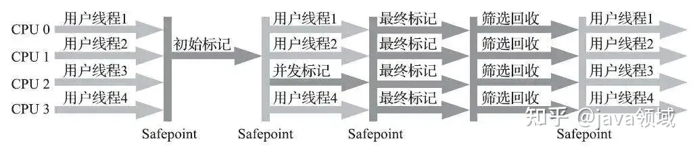
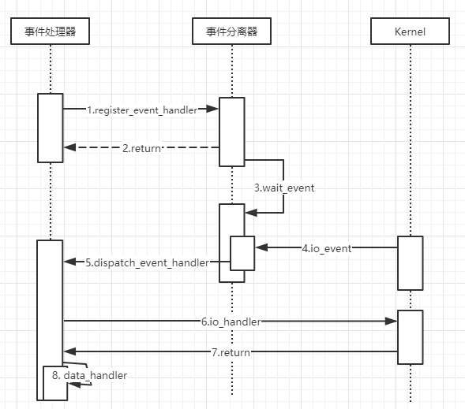

# 基础

## IO模型

文件系统IO分为DirectIO和BufferIO，直接IO一般用在数据库场景； Linux IO模型分为同步阻塞IO、同步非阻塞IO、IO多路复用、异步IO和信号驱动IO，同步/异步是相对于调用方而言的，阻塞与非阻塞是相对于线程而言的(线程是否挂起)
要理解IO模型，首先要理解内核空间与用户空间，所有的IO操作(磁盘IO、socketIO)都是与内核空间交互的；当数据在内核空间准备(第一阶段)好后，再由CPU总线拷贝至用户空间(第二阶段)；阻塞式IO线程挂起，线程利用率低；非阻塞式IO线程不挂起,，但需要不断轮询，占用大量CPU时间


- 阻塞IO：发送请求后用户线程在两阶段均处于阻塞状态

- 同步非阻塞IO：发送请求后用户线程第一阶段不阻塞，第二阶段阻塞(需要轮询就绪状态)
- IO多路复用：类似阻塞式IO，只是select线程可接收大量IO注册，实现线程复用
- 异步IO：发送请求后用户线程在两阶段均处于非阻塞状态，依赖回调通知

<table>
<tbody>
<tr>
<td style="text-align:left"></td>
<td style="text-align:center"></td>
</tr>
<tr>
<td style="text-align:left"></td>
<td style="text-align:center"></td>
</tr>
</tbody>
</table>

### IO多路复用

IO多路复用是一种让单线程监视多个文件描述符事件的机制，一旦有文件描述符读写就绪，可通知程序进行相应的读写；IO读事件会在缓冲区有可读数据时就绪,；IO写事件会在缓冲区有可写空间时就绪；IO多路复用分select/poll/epoll三种实现方式

<table>
<thead>
<tr>
<th>实现</th>
<th>select</th>
<th>poll</th>
<th>epoll</th>
</tr>
</thead>
<tbody>
<tr>
<td>invoke</td>
<td>遍历</td>
<td>遍历</td>
<td>回调</td>
</tr>
<tr>
<td>实现</td>
<td>数组</td>
<td>链表</td>
<td>红黑树</td>
</tr>
<tr>
<td>效率</td>
<td>线性O(n)</td>
<td>线性O(n)</td>
<td>事件通知,fd就绪会放到readyList,O(1)</td>
</tr>
<tr>
<td>限制</td>
<td>1024(x86)/2048(x64)，跨平台</td>
<td>无</td>
<td>无</td>
</tr>
<tr>
<td>fd拷贝</td>
<td>每次把fd集合从用户空间->内核</td>
<td>每次把fd集合从用户空间->内核</td>
<td>调用epoll_ctl拷到内核,epoll_wait不拷贝</td>
</tr>
</tbody>
</table>

#### select/poll

select监视三类文件描述符(writefds、readfds、expectfds)；程序调用select后，会将fd_set集合(数组限制1024/2048)从用户空间拷贝至内核空间， select阻塞(若设定了超时时间select会休眠至超时并尝试获取就绪事件)，等待select返回后遍历fd_set，找到就绪事件；poll原理同select，使用链表将集合大小限制抹除

#### epoll

epoll在内核Cache中维护了一颗红黑树(可以使用hash表但占空间较大)，红黑树的节点数据就是文件句柄fid。epoll_create时，会创建对应的RedayList和红黑树，epoll_ctl时会将fid放入到红黑树(仅拷贝一次)，并注册回调事件(回调事件就是将fid从红黑树移除，放入到ReadyList)。事件就绪或timeout，epoll唤醒扫描ReadyList，将fid拷贝到用户空间，为了提高效率，epoll提供了水平触发(Level Triggered, NIO使用水平触发)和边缘触发(Edge Triggered)两种触发模式，水平触发指事件未被处理下次epoll_wait还会通知，边缘触发指只在状态读缓冲区由空转为非空(可读)、写缓冲区由满转为非满(可写)时通知事件(边沿触发只能工作在non-blocking模式下，需要在EAGAIN时跳出读取循环，处理其他fd，如果工作在blocking模式势必会阻塞在读/写状态，造成其他fd无法调度)

- 水平触发LT：对于读事件非常友好，对写事件不友好，容易造成写事件一直被触发
  - 仅当需要写数据时才将fd加入到epoll模型，注册写事件，等到写数据结束，将fd移除； 小数据量场景操作代价较高
  - 数据要写时，直接写直到返回错误码EAGAIN，再将fd加入到epoll，注册写事件； 等到写数据结束，将fd移除；适合小数据场景

- 边缘触发ET：对写事件比较友好，对读事件不友好，若缓冲区数据一次性没有读完，epoll将不再进行可读事件通知
  - 调整用户读缓冲区大小，保证一次性将内核缓冲区数据读完；要求高，且可能影响其他fd事件
  - 读取数据放到while循环中，直到返回数据小于用户缓冲区大小或错误码EAGAIN

### 零拷贝

<table>
<thead>
<tr colspan="7">
<th colspan="1" style="text-align:left">方法</th>
<th colspan="1" style="text-align:center">调用方法</th>
<th colspan="1" style="text-align:center">CPUcopy</th>
<th colspan="1" style="text-align:center">DMAcopy</th>
<th colspan="1" style="text-align:center">上下文切换</th>
<th colspan="1" style="text-align:center">优缺点</th>
<th colspan="1" style="text-align:center">支持情况</th>
</tr>
</thead>
<tbody>
<tr>
<td style="text-align:left">传统方式</td>
<td style="text-align:center">read()/write()</td>
<td style="text-align:center">2</td>
<td style="text-align:center">2</td>
<td style="text-align:center">4</td>
<td style="text-align:center">浪费资源</td>
<td style="text-align:center"></td>
</tr>
<tr>
<td style="text-align:left">内存映射</td>
<td style="text-align:center">mmap()/write()</td>
<td style="text-align:center">1</td>
<td style="text-align:center">2</td>
<td style="text-align:center">4</td>
<td style="text-align:center">减少一次CPUcopy</td>
<td style="text-align:center"></td>
</tr>
<tr>
<td style="text-align:left">sendfile</td>
<td style="text-align:center">sendfile()</td>
<td style="text-align:center">1</td>
<td style="text-align:center">2</td>
<td style="text-align:center">2</td>
<td style="text-align:center">减少上下文切换</td>
<td style="text-align:center">LINUX2.1</td>
</tr>
<tr>
<td style="text-align:left">scatter/gather</td>
<td style="text-align:center">sendfile()</td>
<td style="text-align:center">0</td>
<td style="text-align:center">2</td>
<td style="text-align:center">2</td>
<td style="text-align:center">批量sendfile,需DMA支持</td>
<td style="text-align:center">LINUX2.1</td>
</tr>
<tr>
<td style="text-align:left">splice</td>
<td style="text-align:center">splice()</td>
<td style="text-align:center">0</td>
<td style="text-align:center">2</td>
<td style="text-align:center">2</td>
<td style="text-align:center">利用管道无CPUcopy</td>
<td style="text-align:center">LINUX2.6.17</td>
</tr>
</tbody>
</table>

## 系统基础

### 地址空间

- 虚拟地址空间/虚拟内存：多任务操作系统中，每个进程都运行在属于自己的内存沙盘中，这个沙盘就是虚拟地址空间(virtual address space)。虚拟地址空间由内核空间(kernel space,1G高字节)和用户模式空间(user mode space,3G)两部分组成，<strong>不同进程的内核空间是一样的</strong>。虚拟地址会通过页表(page table)映射到物理内存(不要求连续,且可能包含外部磁盘存储)，页表由操作系统维护并被处理器引用，每个进程都有自己的页表。虚拟地址到物理地址的转化由内存管理单元MMU完成
  虚拟内存就是一块物理磁盘，每个进程都会将虚拟地址映射到一块虚拟内存，当物理内存不够用时，会将数据交换到虚拟内存(Linux会不时交换不用的内存,并不会等到不够用)，当进程访问虚拟地址，当发现所需数据不在物理内存中时，会引发缺页异常，由操作系统将数据从虚拟内存交换入物理内存
- 局部性原理：时间局部性、空间局部性
- 进程管理
  - 进程控制：先到先服务、最短作业优先服务、优先级调度(抢占式)、轮转调度(时间片)、多级队列调度(固定优先级抢占)
  - 进程通信：管道、消息队列、信号量、信号、共享内存、socket
  - 进程同步
  - 死锁处理
  - 处理机调度
- 内存管理
  - 内存空间的分配与回收：现代操作系统一般使用动态分区分配(空闲分区表)
  - 提供某种技术从逻辑上对内存空间进行扩充：虚拟内存技术(内存页面的交换与覆盖)
  - 提供地址转换功能, 负责程序的逻辑地址到物理地址的转换

    - 虚拟地址空间，MMU地址切换

    - 分页存储技术(将内存划分为多个分区,每个分区4k)

  - 提供内存保护功能，保证各进程各自存储空间互不干扰：每个进程维护一张页表， 互不干扰
- 文件管理：文件存储空间管理、目录管理、文件读写管理与保护
- 设备管理：缓冲管理、设备分配、设备处理、虚拟设备
- 计算/IO密集：计算密集型[如解码]、IO密集型[如Web访问]
  - 高并发， 执行时间短，线程的核心数可设置为CPU核数+1(减少上下文切换)
  - 并发低，执行时间长，IO密集，适当增加线程数[如2倍CPU核数]
  - 并发低， 执行时间长，计算密集，线程的核心数可设置为CPU核数+1(减少上下文切换)
  - 高并发， 执行时间长，可优先考虑缓存(减少IO)，增加服务器(减少并发量)，若IO密集则参考2，若计算密集则参考3

### CPU缓存一致性


<table>
<thead>
<tr colspan="2">
<th colspan="1" style="text-align:left">MESI协议状态</th>
<th colspan="1" style="text-align:center">描述(各个Cache相互监听)</th>
</tr>
</thead>
<tbody>
<tr>
<td style="text-align:left">M(Modified)</td>
<td style="text-align:center">数据有效,仅存在于本Cache,且被修改</td>
</tr>
<tr>
<td style="text-align:left">E(Exclusive)</td>
<td style="text-align:center">数据有效,仅存在于本Cache</td>
</tr>
<tr>
<td style="text-align:left">S(Shared)</td>
<td style="text-align:center">数据有效,存在于多个Cache</td>
</tr>
<tr>
<td style="text-align:left">I(Invalid)</td>
<td style="text-align:center">数据无效(其他Cache修改导致)</td>
</tr>
</tbody>
</table>

### PageCache机制

page cache是OS的文件缓存，用于加速对文件的读写

- 文件读取：读文件未命中pache cache，OS从磁盘读取所需数据时，并对后续数据进行预读取，从而在下次顺序读时命中
- 文件写入：OS会将数据先写入page cache，随后通过异步的方式由pdflush内核线程将数据刷盘至物理磁盘(可强制刷盘)
  - 脏页回写主要由内存不足或脏页超过存活时间限制引起，缺点是会造成延迟

### Linux CopyOnWrite

linux提供的数据copy机制，传统fork()，子进程会拷贝父进程的所有数据，包括全部内存数据；当父进程fork()子进程使用copy-on-write时，子进程只拷贝父进程的页表(Page Table)，不拷贝父进程的堆、栈、段信息，而是采用虚拟地址映射与父进程共享物理内存；仅当父进程/子进程要对数据进行修改时，才会将对应的页拷贝一份，进行数据隔离

### 系统基础Tips

- 内核空间取高1G，实际映射为物理内存的低1G
- 管道是FIFO的内存缓冲区，命名管道会结合磁盘node命名，实际数据也存在内存缓冲区中
- 冯诺依曼结构：输入设备,输出设备,运算器,控制器,存储器
- Buffer VS Cache Buffer一般指要写入到磁盘的数据; Cache一般指已读取的数据
- 孤儿进程：父进程提早退出的进程，孤儿进程的父进程id会被设置为1，托管给init进程，无危害
- 僵尸进程：子进程退出后留下的进程信息没有被收集，导致占用的进程控制块PCB不被释放，形成僵尸进程，占用进程号
  - 所有子进程都会经历僵尸进程阶段，僵尸进程的状态为'Z'，之后需要被父进程调用wait或waitpid处理
  - 处理僵尸进程一般需要将其父进程杀死
  - 避免僵尸进程可通过两次fork()，或在父进程signal(SIGCHLD, SIG_IGN)托管内核回收避免
  - ps -A -o stat,ppid,pid,cmd 查看僵尸线程
  - 产生僵尸线程方式主要是父进程(父进程不退出)对子进程不调用wait/waitpid释放
- 多线程fork时， 子进程只会拥有调用fork的线程的复刻，子进程会继承父进程的锁状态，如果fork已前加锁(可能加锁的不是fork线程)，由于fork后子进程对父进程操作不可见，所以线程加锁会导致死锁，可以在fork时调用pthread_atfork，获得清晰的锁状态
- 中断和异常是用户态到内核态转换的仅有途径

# 数据库

## MySQL-InnoDB

### 基础

B树键和值即存放在内部节点又存放在叶子节点，B+树内部节点只存键，叶子节点则同时存放键和值，叶子结点间存在link，查询稳定
B+树的树高一般为3层；假定每行数据的平均数据1K，那么每个叶子节点可存储16行数据(一般不足1K,叶子结点空间也会被pageLevel、indexNumber、填充因子等占用)，非叶子结点仅存储主键键值和指针，取默认主键Bigint 8字节，指针6字节，则每页可存储16*1024/14=1170，则3层索引所存储的数据量可达1170\*1170\*16=21902400；对于二级索引，叶子结点存储的数据为主键键值，存储量更大，使用二级索引回表(查询聚簇索引)，故更推荐覆盖索引提高查询效率
mysql单机qps在2000~4000左右，取决于表和查询复杂度

- 存储结构：表空间、段、蔟(1M)、页(16k,存储/读取基本单元)；数据和索引存储在ibd文件
  - 一个数据库就是一个表空间，单表也可以配置独立表空间
  - 段是表空间的主要组织结构，如索引段、数据段、回滚段
  - 一个B+索引由内节点段、叶子段组成
- B+Tree索引类型：O(logd(N),d为出度)
  - 聚簇索引：(主键索引>第一个唯一索引>隐藏row_id)叶子节点的data域记录着完整的数据记录
  - 辅助索引：叶子节点的data域记录着主键的值，需回表
  - 覆盖索引：索引域含查询域的所有字段，无需回表
  - 自适应哈希索引：某个索引特别频繁时会为其创建hash索引
    - 通过缓冲池的B+树页构造而来，不需要对整张表构建哈希索引(不支持排序、分组、范围查找)
  - 索引下推：where条件下移引擎层，查询符合索引的数据，并利用联合字段提前where过滤，跳过不符合数据，减少回表
    - 不支持索引下推时，需要先回表，将数据返回server层后再按where条件过滤
- 设计范式
  - 第一范式：列不可再分，确保列的原子性
  - 第二范式：列都和主键相关
  - 第三范式：列都和主键直接相关
- 索引类型优化：索引优化指的是级别在range或之上，联合索引遵循最左前缀原则，保障联合有序
  - const(只匹配一行数据)
  - eq_ref(多表联合匹配一行)
  - ref(普通索引或最左联合索引)、index_merge(or 两边全是索引)
  - range(索引范围)
  - index(索引全扫描，使用到联合索引但不符合最左原则，不需要回表)
  - all(全表扫描)
- 索引维护
  - 利用record_in_range()/info()方法了解数据分布，决定如何使用索引
  - 利用ANALYZE TABLE，决定如何使用索引
  - 利用OPTIMIZE TABLE，清理索引及表碎片
- 执行过程：连接(权限)->分析(词法、语法)->优化(执行计划、索引选择)->执行

### 隔离级别

- 读未提交：不使用；读到其他事务未commit的数据
  - 读不加锁(导致其他事务可以修改)，写时加行级共享锁，未实现MVCC
- 已提交读(RC)：默认隔离级别
  - 读时加行级共享锁，读完释放；写时加行级排它锁，事务提交后释放
  - semi-consistent ：当update读取的行已被加锁时，优先读取已提交数据与where条件比较，不符合则直接跳过行
- 可重复度(RR)：RR 事务下只在第一次select数据前生成一个ReadView
  - 读时加行级共享锁，写时加行级排它锁，事务提交后释放
  - RR未命中索引会锁表，RC只会锁记录
  - RR只是提供解决幻读的机制，MVCC可解决读写冲突的幻读，显式(for update)加间隙锁解决写写的幻读
  - RR级别下存在write-skew问题(UPDATE是先读后写, 前后事务可能读时条件都满足，写完一个后条件就不成立了)
- 串行化：不使用
  - 读加表级共享锁，写加表级排它锁，事务提交后释放，不使用MVCC

### 事务(锁)

- mvcc：即multi-version-concurrency-control，start transaction后并不马上开启事务而是在执行第一条语句才启动的，一致性视图是在执行第一次快照读时才建立；版本号的比较是通过比较事务id，其维护以下变量
  
  - up_limit_id：创建视图启动时，当前系统中创建最早但还未提交的事务
  - low_limit_id：创建视图启动时，最近创建的除自身以外最大事务编号
  - db_trx_id：最后修改某行记录的事务的id
  - m_ids：创建视图启动时，所有事务链表中事务的id集合(当前活跃)
  
  判定方式为：RC一次事务每次快照读都生成ReadView，RR仅在第一次快照读都生成ReadView
  
  - <up_limit_id可见；
  - \>low_limit_id不可见；
  
  - 两者之间，判定db_trx_id(undolog链)是否在m_ids中；存在，则表示当时未提交，不可见；不存在，则表示当时已提交，可见
  
  
  
- 锁种类：共享锁(S,行级)、排它锁(X,行级)、意向共享锁(IS,表级)、意向排它锁(IX,表级)

- 锁属性：行锁、间隙锁、NextKey锁(行锁+间隙锁)、插入意向锁

- 锁粒度：若没用到索引，锁表；若使用索引，但数量多逐次锁行不划算，锁表；若使用索引，涉及数据量较少，锁记录

- 避免死锁：尽量保持资源请求顺序一致；轻量级事务；避免子查询和尽量使用索引

- 锁矩阵

  <table>
  <tr colspan="8">
  <th colspan="1" style="text-align:left">列:存在/行:待加</th>
  <th colspan="1" style="text-align:center">S+行锁</th>
  <th colspan="1" style="text-align:center">S+间隙锁</th>
  <th colspan="1" style="text-align:center">S+NextKey</th>
  <th colspan="1" style="text-align:center">X+行锁</th>
  <th colspan="1" style="text-align:center">X+间隙锁</th>
  <th colspan="1" style="text-align:center">X+NextKey</th>
  <th colspan="1" style="text-align:center">插入意向锁</th>
  </tr>
  <tbody>
  <tr>
  <th colspan="1" style="text-align:left">S+行锁</th>
  <th colspan="1" style="text-align:center"></th>
  <th colspan="1" style="text-align:center"></th>
  <th colspan="1" style="text-align:center"></th>
  <th colspan="1" style="text-align:center">X</th>
  <th colspan="1" style="text-align:center"></th>
  <th colspan="1" style="text-align:center">X</th>
  <th colspan="1" style="text-align:center"></th>
  </tr>
  <tr>
  <th colspan="1" style="text-align:left">S+间隙锁</th>
  <th colspan="1" style="text-align:center"></th>
  <th colspan="1" style="text-align:center"></th>
  <th colspan="1" style="text-align:center"></th>
  <th colspan="1" style="text-align:center"></th>
  <th colspan="1" style="text-align:center"></th>
  <th colspan="1" style="text-align:center"></th>
  <th colspan="1" style="text-align:center">X</th>
  </tr>
  <tr>
  <th colspan="1" style="text-align:left">S+NextKey</th>
  <th colspan="1" style="text-align:center"></th>
  <th colspan="1" style="text-align:center"></th>
  <th colspan="1" style="text-align:center"></th>
  <th colspan="1" style="text-align:center">X</th>
  <th colspan="1" style="text-align:center"></th>
  <th colspan="1" style="text-align:center">X</th>
  <th colspan="1" style="text-align:center">X</th>
  </tr>
  <tr>
  <th colspan="1" style="text-align:left">X+行锁</th>
  <th colspan="1" style="text-align:center">X</th>
  <th colspan="1" style="text-align:center"></th>
  <th colspan="1" style="text-align:center">X</th>
  <th colspan="1" style="text-align:center">X</th>
  <th colspan="1" style="text-align:center"></th>
  <th colspan="1" style="text-align:center">X</th>
  <th colspan="1" style="text-align:center"></th>
  </tr>
  <tr>
  <th colspan="1" style="text-align:left">X+间隙锁</th>
  <th colspan="1" style="text-align:center"></th>
  <th colspan="1" style="text-align:center"></th>
  <th colspan="1" style="text-align:center"></th>
  <th colspan="1" style="text-align:center"></th>
  <th colspan="1" style="text-align:center"></th>
  <th colspan="1" style="text-align:center"></th>
  <th colspan="1" style="text-align:center">X</th>
  </tr>
  <tr>
  <th colspan="1" style="text-align:left">X+NextKey</th>
  <th colspan="1" style="text-align:center">X</th>
  <th colspan="1" style="text-align:center"></th>
  <th colspan="1" style="text-align:center">X</th>
  <th colspan="1" style="text-align:center">X</th>
  <th colspan="1" style="text-align:center"></th>
  <th colspan="1" style="text-align:center">X</th>
  <th colspan="1" style="text-align:center">X</th>
  </tr>
  <tr>
  <th colspan="1" style="text-align:left">插入意向锁</th>
  <th colspan="1" style="text-align:center"></th>
  <th colspan="1" style="text-align:center"></th>
  <th colspan="1" style="text-align:center"></th>
  <th colspan="1" style="text-align:center"></th>
  <th colspan="1" style="text-align:center"></th>
  <th colspan="1" style="text-align:center"></th>
  <th colspan="1" style="text-align:center"></th>
  </tr>
  </tbody>
  </table>

- 两阶段提交：binlog充当redolog二阶段提交的协调者，binlog有日志则直接提交，没有则回滚

  - 事务执行过程中，写入redo log并标记redo log为prepare阶段

  - 事务完成后，写入bin log

  - 写完bin log后，标记redo log为commit阶段

- 2PL 加锁阶段/解锁阶段不交叉，加锁是一行一行加的，解锁是在事务提交之后

- 意向共享/排它锁的加锁/释放是由数据库主动加的，不需要手动处理

### 日志

<table>
<thead>
<tr colspan="5">
<th colspan="1" style="text-align:left">描述</th>
<th colspan="1" style="text-align:center">redolog</th>
<th colspan="1" style="text-align:center">undolog</th>
<th colspan="1" style="text-align:center">binlog</th>
</tr>
</thead>
<tbody>
<tr>
<td style="text-align:left">作用</td>
<td style="text-align:center">确保事务持久性<br/>防止宕机时尚有脏页未写入磁盘<br/>重启mysql时,根据redolog进行重做</td>
<td style="text-align:center">保存事务前一个版本数据<br/>用于回滚或MVCC</td>
<td style="text-align:center">主从复制<br/>基于时间点的数据库还原</td>
</tr>
<tr>
<td style="text-align:left">内容</td>
<td style="text-align:center">物理日志,记录修改后的数据</td>
<td style="text-align:center">逻辑日志,记录版本</td>
<td style="text-align:center">逻辑日志,记录sql+反向sql</td>
</tr>
<tr>
<td style="text-align:left">产生时机</td>
<td style="text-align:center">事务开始后<br/>事务执行/提交时逐步落盘(基于刷盘策略)</td>
<td style="text-align:center">事务开始前<br/>undolog操作会有与之对应的redolog</td>
<td style="text-align:center">事务提交时<br/>一次性写入磁盘</td>
</tr>
<tr>
<td style="text-align:left">释放时机</td>
<td style="text-align:center">事务脏页写入磁盘<br/>空间可重用</td>
<td style="text-align:center">事务提交后不清理,insert可立即清理,update日志放入purge队列,purge判定其他事务不占用时清理</td>
<td style="text-align:center">expire_logs_days指定</td>
</tr>
<tr>
<td style="text-align:left">补充</td>
<td style="text-align:center">redolog写盘到Innodb_log_buffer<br/>支持每秒刷/事务刷/大小刷</td>
<td style="text-align:center">5.6前undolog记录在共享表空间<br/>5.6后支持独立undo表空间</td>
<td style="text-align:center"></td>
</tr>
<tr>
<td style="text-align:left" colspan="1">补充</td>
<td style="text-align:left" colspan="4">redolog主要用于保证事务持久性(事务层)；binlog主要用于数据库还原(数据库层)<br/>基于redolog的数据恢复效率高于binlog；事务提交时，为保证主从复制一致性，写入顺序要求严格一致(先redo后bin)；relaylog用于主从复制从节点，binlog被同步到relaylog即认为同步完成<br/>binlog充当redolog二阶段提交的协调者，2PC两阶段提交，保证了redo log和bin log的逻辑一致性，进而保证数据的不丢失以及主从库的数据一致
<br/>
</td>
</tr>
</tbody>
</table>


### 性能优化

- 表设计优化、优化sql和索引(适当增加索引，优化SQL)、优化mySQL配置
  - 优先选择符合存储需要的最小的数据类型、避免text\blob
  - 不要使用mysql枚举(修改要alter表)
  - 尽量约束not null、索引字段为NULL会被排除在索引之外
  - 使用timestamp而不是date
  - 限制索引数量，一般不超过五个，使用短索引(能用int不用varchar)，索引字段尽量有序
  - 频繁查询考虑使用覆盖索引、避免查询不必要字段
  - 避免使用子查询、多join，必须使用时调整join_buffer_size优化性能
  - 尽量避免使用or、like、not in、!=，避免函数或隐式类型转换
  - 超一百万行的批量写，要分多次执行
  - 避免大事务
  - 优化深度limit分页(子查询查出id后使用范围查询或in)， 使用主键范围查询
  - 使用union all 代替 in或or
  
- 增加缓存(提高热点数据命中率，防止缓存穿透)

- 主从复制-读写分离：半同步复制/同步双写

  

- 使用MySQL自带分区表(可跨磁盘)

- 垂直拆分(业务相关,即微服务化，将不同服务额表分布在不同的数据库上)

- 水平拆分(数据量级达到瓶颈后，使用水平拆分，优化查询耗时)

### 主从

主节点写binlog，从节点根据position同步最新的binlog，并写入relaylog，从节点扫描relaylog，执行重放

- 主从复制方式：statement、row、mixed
  - statement：基于sql记录，数据量小，但容易因存储过程/函数等因素出现bug
  - row：基于行value修改记录，可读清晰，但日志量较大
  - mixed：statement/row结合版本，add/update/delete基于row，表结构修改等基于statement
- 主从复制问题
  - 数据丢失：可通过半同步复制解决
  - 时延问题：可通过开启从库并行复制缓解(组提交)；分库分表，降低读写压力缓解
  - 主从不一致：未开启配置、版本/触发过程不一致、从库写入、binlog/relaylog损坏
- 主从切换：如配置优选从库则从中选择，否则选择同步日志最大的从库


### 数据迁移+扩容方案

- 停机迁移方案：公告暂停服务->数据迁移->新服务上线
- 不停机迁移方案：
  - 服务上线，同步双写数据(读老库)
  - 新旧库数据同步(根据时间戳判定是否覆盖)脚本
  - 校验一致性[对于不一致的数据重复2-3]
  - 服务上线
- 扩容方案：一般一次性完成分库分表(多个库放一台机器)，当机器扛不住时，直接迁库到新机器即可


### 分片方案

主流分片方案分DB proxy(如Mycat)和JDBC proxy(如sharding-jdbc)。DB Proxy一般会实现数据库协议，缺点是链路长、Proxy单点、Prepare支持度不够，JDBC Proxy一般与业务层部分耦合，缺点是接入繁琐、DB不透明、语言限制
Sharding+Proxy方案实际只解决了单机容量问题，适用于简单SQL场景；对于跨纬度join、数据聚合、唯一键约束、业务拆分维度、多维度支持、Hash/Range对应的多访问与热点数据等问题均需要做折中；同时Sharding+Proxy方案还引入了全局ID问题(步长自增，容易埋坑；依赖时间一致性)、数据维护成本问题、运维友好度问题、业务兼容性问题、拆分扩容设计问题等


### Tips

- 元数据设计：横向表(适用于字段稳定场景) VS 纵向表(适用于字段多变场景)
- MySQL 应统一使用字符集utf8mb4
- ORM框架的悲观锁一般由for update实现；乐观锁一般需要配合设计增加版本字段
- redolog写入机制：写redolog buffer(每s刷page cache，依赖系统刷盘)；写page cache，每s刷盘；每次刷盘
- binlog写入机制：写page cache，依赖系统刷盘；每次刷盘；每N次刷盘
- 数据恢复：时间节点备份+binlog
- 慢查询原因：偶尔慢-刷脏页、锁竞争；普遍慢-引擎不当、没走索引、索引选择错误等，需分析优化
- 若索引key过长会导致单Page存储数据变少，间接导致索引页目数增多，索引层次增加，影响效率
- innodb join
  - 字段有索引时底层使用index nested-loop join算法，先匹配驱动表，再通过索引查找匹配表数据
  - 字段无索引时底层使用block nested-loop join算法，批量将数据(所有查询字段)导入到缓冲区，减少驱动表循环次数
- innodb order by：查询数据大小小于sort_buffer，内存排序；大于sort_buffer，外排序(临时文件,12路)
  - 全字段排序：查询字段大小小于max_length_for_sort_data时，取出全部字段，整体排序并返回
  - rowid排序：查询字段大小大于max_length_for_sort_data时，取出主键和排序字段，排序阶段，并根据主键回表查询其余字段

- in适合于外表大而内表小的情况，exists适合于外表小而内表大的情况
- 外键有利于数据一致性(反应业务关联)，但设计表时不建议使用外键，外键会导致数据迁移麻烦、性能有损
- 8.0之前自增主键id存储在内存，重启丢失；8.0及以后记录在redolog

## Redis

### 基础

- 数据类型：String、Hash、List、Set、Zset、Pub/Sub、HyperLogLog

- HyperLogLog：基于基数统计和概率的海量数据计数器(数据量越大越准确)
- Redis支持Bloom filter插件

#### 数据结构

- 使用skiplist实现zSet

- 使用字典实现Set/Hash(底层还是数组)

- 使用quicklist(链表)实现List：兼具压缩和防止连锁更新(插入新节点，引发prev变更，导致自身长度表示从1->5字节)问题

  

- 使用ziplist实现压缩存储：通过记录偏移量(1字节或5字节)节约指针开销(8Byte)

  - zlend固定值255，结束标记
  - prevrawlen代表上一个节点的长度(1字节或5字节)，小于254则为1字节，大于254为5字节(此时第一个字节固定254)
  - len/enconding代表编码和自身长度(1字节或5字节)，使用位规则区分数字或字节，尽可能进行压缩
  - content数据内容
  
  

### Redis设计与实现

- string
  - 采用预分配(多申请一些free空间)和惰性回收(缩短字符串等于变相增加free)提高字符串修改时的效率
  - 扩容时默认成倍扩容，若原始字节>1M，则扩容为 字符串大小+1M
  - Redis key-value String 最大512M
- 缓存过期删除：定时删除(浪费大量CPU时间)；惰性删除(浪费大量内存)；定时+惰性
- IO模式为IO多路复用、单线程(避免上下文切换)
- AOF重写是一个类似RDB的过程(直接读取内存，而不是分析现有log)，重写期间新增写会写入AOF缓冲区
- Redis事件分为文件事件(读写)和定时事件/周期事件(如扫描过期key)，服务器轮流执行这两类事件
- 主从复制过程
  - slave第一次连接master，发送'PSYNC'，master执行'BGSAVE'生成RDB，并将RDB期间的指令存入复制缓冲区
  - 传输RDB文件；传播复制缓冲区指令
  - slave触发指令传播，主从同步；传播指令会在传播同时写入复制积压缓冲区(默认1M，一般会重新配置)
  - 主从心跳断开重连，slave发送'PSYNC'，触发指令传播(断点续传)或RDB
- Redis集群分2^14个槽(平衡数量和心跳包大小2k)，使用CLUSTER ADDSLOTS向节点指派槽，节点间会同步所负责的槽集合；客户端发送指令到Redis，Redis会根据CRC16算出槽节点位置，是自己则处理指令，否则返回MOVED+重定向信息(槽编号,地址)
- 对于集群PUBLISH，是客户端向某个节点PUBLISH再由节点向其他节点广播的
- 节点通信多由PING(探活)、PONG(响应)、MEET(握手)、PUBLISH(消息广播)、FAIL(节点下线广播)实现，使用gossip协议实现
- 乐观锁：watch key;multi;/\*批量操作\*/;exec 利用watch监控key(键过期,依然生效)，若改变，事务不提交；若事务执行指令不会回滚
- MONITOR命令会将客户端变成监视器，接收集群执行的所有命令+客户端信息
- 重分片过程，客户端查询到直接返回；查询不到则判定slot是否正在迁移，引导Redis客户端重定向到新slot节点
- Redis 写丢失场景主要有异步复制、主从切换，主要通过min-slaves-to-write、min-slaves-max-lag保证主从同步
- Redis 4.0+的单机qps可达10~20万，tps达10万(一般需要redis-benchmark压测实际量)
- Redis使用发布订阅实现异步队列，在无订阅者时消息会丢失
- Redis利用多核心可通过单机部署多实例方式实现

### 缓存缺点

- 一致性：缓存只保障最终一致性，强一致性可采用数据库读写分离等；非强一致可采用双删策略、binlog订阅
- 热key问题：热key监控，使用二级缓存，读取时优先读二级缓存；Cluster方案
- 雪崩(缓存集中失效)：缓存预热；失效时间加随机数，防止集中失效；本地缓存兜底；服务降级兜底
- 击穿(缓存单个失效)：互斥锁策略(限制并发量)
- 穿透(查询不存在数据)：布隆过滤(使用bitmap映射查询条件,拦截不合法查询);缓存空对象
- 无底洞(批操作涉及多次网略请求)：优化批处理操作，减少通信次数；使用长连接
- 并发写竞争：使用watch乐观锁(或是独占锁)

### 数据淘汰策略

- noeviction：不删除，再次存储时返回错误策略
- allkeys-lru：数据集的最近最少使用优先淘汰策略
- allkeys-random：数据集的随机淘汰策略
- allkeys-lfu：数据集的最不经常使用的key数据淘汰策略(4.0+)
- volatile-ttl：自动过期数据集的顺序消亡淘汰策略
- volatile-random：自动过期数据集的随机淘汰策略
- volatile-lfu：已设置过期时间数据集中挑选最不经常使用的数据淘汰策略(4.0+)
- volatile-lru：自动过期数据集的最近最少使用优先淘汰策略

### 持久化

Rdb或aof重写时可能造成内存突增，因此一般要保持25%的余量

- rdb(快照模式全量持久化)：rdb在保存快照时会fork出子进程(主存页拷贝)，fork会阻塞主进程(拷贝父进程的所有状态)，rdb每次都会生成一个完整的快照文件(之前的快照可删除)，rdb定期生成，crash时会造成数据丢失

- aof(增量持久化) ：安全性高，AOF文件易读、可修改，性能消耗高，数据恢复速度慢；AOF文件比RDB更大(采用auto-aof-rewrite-percentage可重写AOF)，有always(同步刷盘)、everysec(每秒刷盘)、no(依赖os)几种刷盘模式

### 扩容

redis集群保存有hash槽与机器的映射，当添加节点时，需要通过执行 resharding 重新分配hash槽，Presharding 类似于MySQL倍增扩容，即开始时多个节点在一台机器上，后续扩容将部分节点牵制其他机器

### 渐进式hash

在Redis底层数组元素超过一个阈值时，会触发一个Rehash操作(扩容2倍或1/2),，为减少重复扫描和数据遗漏，会进行高位掩码&操作，确定实际的扫描bucket；渐进式hash不是一次性完成hash，而是将每个数组空间的转移分摊到各次请求(使得各个请求耗时比较平滑)。Rehash时会重新分配数组内存，会导致内存抖动


### 高可用

#### 主从模式

master节点挂掉后，slave无法自动提升为master，服务不可用

#### 哨兵模式

master节点挂掉后，slave自动提升为master，继续提供服务(哨兵集群，可监控多组master/slave)

- Sentinel集群至少quorum个节点时，拥有主从切换能力
  - 每10s执行INFO(发现slave，确认主从关系）
  - 每2s与master交换信息(其实是发布订阅消息)
  - 每1s执行PING/PONG心跳操作
- 选主流程
  - 单个Sentinel心跳检测到master下线，标记master为主观下线SDOWN并广播
  - 超过半数Sentinel标记master下线，标记master为客观下线ODOWN
  - matser客观下线后Sentinel会相互投票(slave优先级、数据偏移量、进程ID顺序)推举Sentinel Leader进行故障转移
  - 将其余slave(包含宕机的master)指向被选举节点


#### 集群模式

master宕机，由slaves(随机延迟)发起选举(只有master可投票)，raft机制；同时半数以上master挂掉无法选主

- 选主流程

  - 所有节点相互通信PING/PONG，当master获取其他master响应超时时，会将其节点标记为疑似下线PFAIL

  - 当某节点被超过半数master节点标记疑似下线后，会将其节点标记为下线FAIL

  - FAIL节点的slave感知后，延迟500+500rand+rank*1000ms，发起拉票，由master投票(先到先得)，超过一半后选为master
    - 500ms固定延时保证所有slave能全部感知，rank为slave排名，同步数据越多排名越高，数据越新越优先
  - 被选中的slave执行 SLAVEOF no one成为master
  - 撤销原master的指派槽，并将其指派给自己
  - 广播PONG消息，通知其余 master


### 大key排查

- bigkeys：排查(string按长度,集合按元素多少)，非阻塞
- scan | head -n排查(string按长度,集合按元素多少)，非阻塞，debug object key 查看某个key序列化后的大小
- 使用redis-rdb-tools 分析rdb文件，排序

## LevelDB/RocksDB

LevelDB为KV存储磁盘数据库，RocksDB是LevelDB的升级版，底层实现是LSM-Tree(Log Structured Merge Tree)

### 架构


### 读写


- 读：MemTable(跳跃表)->ImmuTable->各层SSTable
- 写：MemTable可读写，ImmuTable只读

  - 在MemTable开辟空间不足时冻结MemTable，转为ImmuTable，开辟新的MemTable并切换logFile
  - 记录日志(WAL)，崩溃恢复
  - MemTable插入数据
  - 修改操作都会获取全局递增序列号，数据上保存有限个版本
- 合并策略：
  - size-tiered：每层达到数量N，合并追加放入下一层(有重复)，会有比较严重写放大
  - leveled：每层达到一定大小，与下一层合(有序且无重复)

- ImmuTable会由异步线程刷新到LV0，删除日志
- Manifest负责记录系统某个时刻SST文件的视图
- Current文件记录当前最新的Manifest文件名(断电异常识别)
- RocksDB增强了并行化写入(允许多个MemTable)、压缩、副本机制
- levelDB和rocksDB都存在读写放大问题(写合并，读分层查询)

# MQ

- 使用场景：削峰、发布订阅、异步、可恢复、顺序保证、分布式事务(最终一致性)、应用解耦
  - 流式处理场景基本选用Kafka，业务处理相关选择RocketMQ
  - kafka是一个分区(一个broker多个分区)一个文件、RocketMQ是一个broker一个文件，kafka并发支持更高，topic/partition过多会有性能下降；
  - 都采用了零拷贝技术，kafka采用sendfile，rocketMQ采用mmap，sendfile效率更高
  - RabbitMQ性能极其好，延时很低(微秒)，其他为ms

- 缺陷：系统可用性降低、系统复杂度提高、一致性问题
- 优势：可伸缩、消息不丢失、高可用

## rocket


### 基础概念

- nameServer：注册中心，nameServer无状态
- producer/consumer：生产者/消费者，与任一节点、brokers保持长连接
- broker集群(主从)：broker与nameServer所有节点保持长连接(双写、异步复制)
- topic：标志消息类型(分布于多个broker)，消息订阅的单位
- tag：消息标签，利用tag过滤消息
- queue：一个topic对应多个queue

### 消费模式 push/pull

- 消息push模式基于pull模式实现(长轮询pull)，qps 5w~7w
  
- 消费模式：广播消费、集群消费
  - 广播消费的offset持久化在client本地，拉取消息时传入offset
  - 集群消费的offset保存在broker，并定时序列化到磁盘
- 消息模式：顺序消费、无序消费
  - 顺序消费需保证consumer节点与queue一对一，consumer使用顺序消费模式(全局有序需将queue数量设置为1,牺牲高可用)
- 消费策略：支持同步ACK写、异步ACK写、ONEWAY写、批量写，ACK机制保证消息至少被消费一次
  - At last one至少一次(收到ack为准)
  - Exactly only once仅有一次(rocketMQ不保证)

- 主从复制：同步双写、异步复制
- 刷盘方式：基于NIO的内存映射机制MappedByteBuffer，现将消息追加到内存，再根据刷盘方式刷盘
  - 同步刷盘(commitlog)，不会丢失消息，写page cache，同步刷盘
  - 异步刷盘固定频率刷盘，可能丢失少量数据
    - 若开启transientStorePoolEnable，会开辟堆外内存，先追加到堆外内存，再频率写page cache，刷盘
    - 若不开启transientStorePoolEnable，写page cache，频率刷盘
- 数据过期
  - rocketMQ会保留72小时未消费数据，积压太多可能丢消息，需要接入报警
  - rocketMQ无拒绝策略，会导致磁盘打满，需要监控磁盘使用情况

- 消息过滤/防重
  - broker端过滤，减少网络传输、实现复杂 (支持Tag、SQL92表达式、类过滤)
  - consumer端过滤/防重，实现简单、消耗带宽


### 定时任务

RocketMQ不支持细粒度定时任务，只支持特定级别(1s,5s,10s,30s,1~10m,20m,30m,1h,2h)延时
每类延时消息对应一个消息消费队列，每个队列有一个0.1s ticker，队列id为(延时级别-1)；消息写入commitLog前，判定若是延时消息，则替换和保存原主题、消费队列信息，并将消息转发到对应延时topic，写commitLog；每ticker，会根据offset和commitLog读消息判定是否到期，若到期则恢复原消息主题、队列信息，删除延时级别，转发至正常topic

QMQ使用时间轮+外部存储实现任意时间的延时，时间轮精度可通过多重时间轮进行改善

### 持久化(文件形式)


- 名词解释
  - commitLog：消息数据存储文件(默认1G,文件名为偏移量)，顺序写
  - consumeQueue：消息索引文件，顺序读(根据消息索引随机读commitLog)，大小固定30W*20(8offset+4大小+8tagHash)
  - indexFile：hash索引文件，提供按时间段，Key等查询消息的索引
  - checkpoint：记录commitLog、consumeQueue、indexFile三个文件的刷盘时间点
- 写：
  - 顺序写commitLog
  - 异步将消息dispatch到consumeQueue(仅索引)
- 读：
  - 顺序读consumeQueue
  - 根据地址到commitLog随机读消息实体
- 读写性能优化
  - 内存预分配：预先分配下一个、下下一个CommitLog的文件映射
  - 文件预热：分配内存后写入随机值保证内存占用、map映射后为防止缺页调用madvise
  - mlock系统调用：锁定内存，防止其被交换到swap空间
- 异常情况
  - broker正常关闭、broker异常Crush、OS Crush、机器掉电恢复 broker节点可正常工作
    - broker启动时会创建abort文件，正常关闭时删除
  - 机器损坏、磁盘损坏 broker单点故障，人工干预

### 事务

broker是一个天然的协调点，订阅者一定要做好幂等

### Tips

- comsumer仍可从slave读取数据消费，消息会写入到其他broker

- 消费者从主节点拉取消息后，会根据负载情况及主从复制情况向consumer提出拉取从节点建议
- 不建议开启自动创建topic，可能会导致仅在单broker上有queue
  - 发消息后，无法获取topic路由，会在某一个broker自动创建topic，并将其注册到nameserver
  - 之后的消息能在nameserver获取路由，导致消息全部发送到单点broker
- MQ消息丢失，人工介入补发消息

## kafka

kafka自动提交offset会导致消息丢失(未来得及消费,宕机)，手动提交offset会导致消息重复消费，100~300W tps

# Web

## 基础

### osi

<table>
<thead>
<tr colspan="1">
<th colspan="1" style="text-align:left">层级</th>
<th colspan="1" style="text-align:center">主要协议</th>
<th colspan="1" style="text-align:center">交互格式</th>
<th colspan="1" style="text-align:center">负载均衡</th>
<th colspan="1" style="text-align:center">组件</th>
</tr>
</thead>
<tbody>
<tr>
<td style="text-align:left">应用层</td>
<td style="text-align:center">HTTP(超文本)<br/>SMTP(邮件)<br/>DNS(域名)</td>
<td style="text-align:center">报文</td>
<td style="text-align:center">DNS负载均衡(延迟、缓存效应)<br/>反向代理(对服务器要求高,灵活)<br/>HTTP重定向(应用较少)</td>
<td style="text-align:center">WEB应用</td>
</tr>
<tr>
<td style="text-align:left">传输层</td>
<td style="text-align:center">TCP<br/>UDP</td>
<td style="text-align:center">数据段(TCP)<br/>数据报(UDP)</td>
<td style="text-align:center">LVS<br/>f5</td>
<td style="text-align:center">四层交换机</td>
</tr>
<tr>
<td style="text-align:left">网络层</td>
<td style="text-align:center">IP<br/>ARP<br/>RARP</td>
<td style="text-align:center">数据包(IP包)</td>
<td style="text-align:center">IP点对点通信<br/>ARP 根据IP获取MAC<br/>RARP 根据MAC获取IP</td>
<td style="text-align:center">路由器</td>
</tr>
<tr>
<td style="text-align:left">链路层</td>
<td style="text-align:center">以太网<br/>帧中继等</td>
<td style="text-align:center">帧</td>
<td style="text-align:center">MAC点对点通信</td>
<td style="text-align:center">网卡<br/>网桥</td>
</tr>
<tr>
<td style="text-align:left">物理层</td>
<td style="text-align:center">X.21</td>
<td style="text-align:center">byte</td>
<td style="text-align:center"></td>
<td style="text-align:center">中继器<br/>集线器</td>
</tr>
</tbody>
</table>


## http/TCP/IP

### Tcp三次握手/四次挥手

三次握手是为了确认客户端/服务端均有收发能力，等待2MSL(Maximum Segment Lifetime,报文最大生存时间,默认2min)可以提供足够的时间让这个连接不会跟后面的连接混在一起(数据消亡)


### tcp/ip/udp协议tips

- Tcp协议头：源端口/目的端口、SequenceNumber(顺序)、AcknowledgeNumber(丢包)、滑动窗口(流量控制)、TCP Flag(状态位)

- 流量控制：滑动窗口，使发送/接收方均有足够的buffer处理数据

  

- 拥塞控制：慢开始快恢复(从1开始,ssthresh默认65535)、加性增乘性减

  

- 重传机制：TCP只能确认最大的连续收到的段；故有超时重传、快速重传(收到3次同一ACK)、SACK、DASK

- RST连接异常：目的端口不存在、向关闭连接发送数据、向崩溃对端发送数据、网络不可达(超过重试次数)

- 粘包/拆包：粘包一般由Nagle算法/缓冲区读取不及时引起(NO_DELAY)，拆包主要由数据量过大/缓冲区太小引起(定长、消息头/消息体、分隔符法)

- 糊涂窗口：协商的窗口大小小于协议头(接收端可在窗口小于某个值时确认0,阻止发送方发送; 发送方可使用Nagle算法, 延时发送)

- tcp分段-ip分片：受MTU限制，tcp主动数据分段、udp不主动分段，ip协议会对超过MTU限制的数据进行分片，并根据偏移量重组

- keepalive：长连接，无交互存活2小时， 共探测10次，间隔75秒；keepAlive只能用来探活网络

- 心跳：保活(防止被防火墙Kill)、死链检测(路由故障)

- ipv4/ipv6：ipv4与ipv6协议栈不兼容，需要做双栈协议兼容

  - ipv4采用32位10进制写法，ipv6采用128位16进制写法，ipv6地址空间比ipv4大得多(ipv6只支持组播，不再支持广播)
  - ipv4最小数据包大小为576字节，IPv6最小数据包大小为1208字节
  - ipv6支持分层结构编码(即类似电话号码一样，国家-区号...)

- Tips

  - MTU：最大传输单元，受链路层数据帧大小限制，最大数据传输1500字节， 最小576_ipv4(1208_ipv6)
  - 半打开：一方关闭而另一方不知
  - 半关闭：四次挥手完成一半，另一方未开始
  - 半连接：完成前两次握手后不进行第三次(默认重试5次，1/2/4/8/16/32，累计63s)
  - 第三次握手可携带用户数据
  - IP数据包最大64k；协议头TTL用于控制最大路由转发次数(8bit)，递减小于0后抛弃
  - Zero Window：接收端可用缓冲为0返回窗口大小为0，发送端不再发送数据，转而ZWP技术让接收方确认可用窗口大小

### http协议tips

- 五元组：源端口、目的端口、源地址、目的地址、传输协议

- http报头：下图为请求头，响应头与之类似，请求行变成状态行

  

- 正向代理：指用户明确知道去哪,但需要走代理(翻墙)；

- 反向代理：指用户也不知道去哪(负载均衡)

- SSL握手过程(SSL引入了第三方机构管理证书，证书含网址、颁发机构等信息，无法伪造)
  - 客户端发送其支持的算法列表和客户端随机数A
  - 服务端返回选择的算法,服务端证书(包含服务端的公钥)，服务端随机数B
  - 客户端验证证书，提取公钥，生成随机数C，公钥加密随机数，发送给问服务端
  - 服务端使用私钥解密随机数
  - 服务端/客户端使用三个随机数及选择的算法生成对话秘钥
  - 通信中，若session中间断开，重连后只需发送上次对话的session ticket，不需要重新握手
  
- 会话保持(Cookie+Session是实现会话保持的最通用方案)
  - Cookie：服务端设置，客户端存储(<4k)，浏览器自动设置
  - Session：服务端存储(用户登录信息、权限信息)
  - Token：基本同Cookie，但需要js手动设置(可防止CSRF攻击)，一般含加密用户信息，无需Session配合
  - Url重写：基本同Cookie，主要用于禁用Cookie场景，实现较复杂
  
- 请求过程
  
  - 输入网址
  - 解析为IP(浏览器缓存、hosts、LDNS、RootServer、GTLD、NameServer)
  - 构造Http报文
  - TCP连接
  - 网络路由传输(IP、ARP、RARP)
  - 服务器接收处理并返回
  - 解析报文、渲染HTML
  - 请求HTML中依赖的其它资源
  
- http1.0、http1.1、http2.0区别
  
  - http1.0默认短连接，1.1和2.0默认长连接
  - http1.1开始支持header range域，允许只传递一部分资源，支持pipeline
  - http1.1开始支持header host域(传递主机名)，ip共用场景比较有用
  - http2.0(基于google SDPY)开始采用多路复用降低延迟(tcp慢开始)
  - http2.0开始支持header压缩
  - http2.0开始支持服务端推送(如静态资源)，推送到前端后放入缓存
  - http2.0支持二进制格式传输，1.x基于文本
  

### DNS

根域名服务器(root name server)共有13台(实际存在很多副本)，分属于12个组织独立运营，根域名服务器维护顶级域名到IP的映射；一般DNS服务提供商会缓存此映射； 顶级域名(TLD,top level domain)包含.com、.net、.cn等等，顶级域名被托管给公司或政府

- 浏览器查询自身缓存，命中则解析结束，否则
- 检查本地系统缓存是否命中(如windows hosts)，命中则解析结束，否则
- 请求本地域名服务器LDNS，命中则解析结束，否则
- LDNS请求根域名服务器，获取顶级域名所对应的顶级域名托管IP(gTLD,generic-TLD)
- LDNS请求gTLD获取Name Server域名服务器(大概率是注册时的域名服务器)
- LDNS请求Name Server获取域名/IP映射以及TTL
- LDNS缓存域名/IP映射
- 解析结束，返回给本地系统/浏览器，本地系统/浏览器根据TTL缓存域名/IP

### 跨域

- CORS(Cross-origin resource sharing)，跨域资源共享
- @CrossOrigin注解，允许跨域访问
- nginx反向代理接口跨域：同源策略是浏览器的安全策略，服务器端调用HTTP接口只是使用HTTP协议，无同源策略
- 通过jsonp跨域

## Tips

- ngnix使用io多路复用(epoll)模型处理大量io请求，支持轮询、加权轮询、ip_hash(ip绑定)等负载策略

# JAVA

## JAVA Tips

- java是一门静态多分派(方法重载)、动态单分派(方法复写)的语言
- 死锁条件: 资源互斥，循环等待(资源编号)，请求和保持(一次性申请)，不可剥夺(允许抢占或检测杀死)
- CAS：无限循环自旋volatile变量，CAS参数(对象,偏移量,期望值,更新值)
- AtomicStampedReference基于时间戳解决了CAS的ABA问题
- servlet生命周期：类装载、init()、service()、destory()
- volatile通过内存屏障实现禁止重排序(构造方法重排序，对象可能未初始化完成引用就逃逸)，强制同步主存保证可见性
- 静态方法和静态变量可被继承，但无法复写(方法和变量是绑定在类上的，只与声明相关)
- 内部类的设计意图是为了获取更好的封装性、代码简洁、方便维护
- 非static的内部类，外部类加载时，它不会被加载，所以它不能有静态变量或方法
- 局部内部类只能引用外部局部final变量(涉及变量作用域，成员变量除外)
- JVM采用CAS来保证多线程更新free list的原子性
- JAVA BIO在QPS 1000左右表现良好；
- JAVA NIO 主要指FileChannel、MMAP(MMAP仅在少数场景下性能略优于FileChannel)
- 调度器主要通过时间轮(环形数组)、时间堆(小顶堆)、红黑树等方式实现
- classloader.loadClass() 和Class.forName的区别是forName会触发对象初始化(执行static{}、初始化static变量)
- Runtime.getRuntime().addShutdownHook(shutdownHook)
- JAVA线程异常退出，不会导致JVM退出
- wait(notify)需配合synchronized使用，释放锁并等待；await(signal)是Condition的方法，支持AQS同步
- 以'java.'开头的自定义包会被拒绝加载
- Thread.UncaughtExceptionHandler允许在每一个Thread对象上添加一个异常处理器
- lambda表达式只支持@FunctionInterface注解的单方法接口
- List扩容默认为原来的1.5倍(cap=cap\*1.5>newCap?cap\*1.5:newCap)
- hashMap最大容量1<<30，每次扩容为原来的2倍，减少hash碰撞，并行转移
- 面向对象四大特性：封装，继承，多态，抽象
- 面向对象原则
  - 单一职责
  - 开闭原则：对象修改最小化
  - 里式替换：程序扩展中抽象被具体可以替换
  - 迪米特：高内聚，低耦合
  - 依赖倒置：面向抽象编程
  - 接口隔离：接口设计大小要适中


## 数据结构

### map

- ConcurrentHashMap7：使用Segment(实现了AQS)，确定数据先Hash到Segment，再hash到Node

- ConcurrentHashMap8：Node粒度(默认并发度16,负载因子0.75)，2倍扩容，简化hash，引入了红黑树优化了查找性能

  - 使用2^N容量，利于计算hash，扩容时位置不是在i处就是在i+2^N处；同时利用<strong>高低16位异或</strong>提高散列度

  - get()先hash，再根据节点类型查询(Node的val由volatile修饰，读取不加锁，可保证可见性)

  - 若链表节点大于8，转化为红黑树(size<64&链表长度>8,实际引发的操作是Map扩容)；红黑树节点小于6，触发退化为链表

  - put() 先判空 hash，数组位置为空则CAS，否则写链表或TreeBin

    - 读写并发时，若节点为TreeBin，读操作会退化为链表查找

    - 并发扩容(维护状态标志操作)
      - 维护了一个transferIndex标志扩容的起始index(扩容顺序为从右往左)
      - 线程进入时会分配一个扩容区间，扩容时将数据扩容到nextTable，并将table原数据点改为ForwardingNode
      - 允许多线程同时扩容(不同的Node)

  - 为何使用synchronized 
    - 差距不大且可简化逻辑，后续JVM优化可受其红利
    - 使用lock则Node要实现AQS，实现复杂浪费内存，仁者见仁智者见智(复杂度+性能的取舍)

### 父子线程ThreadLocal

ThreadLocal(TL)只是个工具，主要用来空间换时间，数据实际存储在Thread对象的ThreadLocalMap中，框架中主要用TL存储session或Connection或RpcContext，ThreadLocalMap的Key是ThreadLocal对象本身，弱引用，可被回收；ThreadLocal可用于无锁设计
实现父子线程TL变量的传递(不是共享，线程池模式)

- TL子类InheritableThreadLocal(ITL)实现了父子线程的数据传递
  - 在New Thread时检查父线程 ITL，并用父线程ITL初始化子线程的ITL
  - 无法解决线程池模式下的数据污染和传递
- ITL子类TransmittableThreadLocal(THL)实现了父子线程(支持线程池)的数据传递
  - 继承ITL能力，并维护了一个ITL，父线程THL读写时将THL捕获入ITL(Set,可含多个THL)， remove时取消捕获
  - 装饰模式装饰线程池，增强Runnable
    - 在run()前获取所有被捕获的THL的数据，传递到子线程;
    - 在run()后恢复子线程之前的数据

## JVM

### 基础

java基础属性包括抽象、封装、继承、多态

- 新特性
  - Java5 泛型、自动拆箱
  - java7 try-with-resource、异常|
  - java8 lambda表达式、函数式接口、StreamAPI、WorkStealingPool
  - java9 Http2.0、G1、响应式编程
  - java10 var、G1fullgc并行化
  - java11 String加强、ZGC、switch表达式
  - Java13 “”“文本

- 内存模型：内存模型仅代表一系列的抽象规则
  - 可见性(volatile、synchronized、final)
  - 有序性(volatile、synchronized、happen-before)
    - 程序顺序规则：一个线程中的每个操作happen-before任意后续操作
    - 监视器规则：一个锁的释放happen-before随后对锁的获取
    - volatile规则：volatile域的写happen-before任意后续对此域的读
    - 线程start规则：线程A执行B.start()操作happen-before B代码的执行
    - 线程join规则：线程A执行B.join()后B代码的执行happen-before A的返回
    - 线程中断原则：对线程的interrupt操作happen-before被中断线程检测到中断
    - 传递性：A happen-bofore B，B happen-bofore C，则A happen-before C
  - 原子性(read、load、use、assign、store、write、lock、unlock)
- 内存结构
  - java堆：大部分对象、数组、常量、静态变量
  - 方法区(metaspace)：类信息、编译后的代码、运行时常量
  - 程序计数器：控制分支、跳转、循环
  - 本地方法栈：JNI本地方法调用栈
  - 虚拟机栈：即线程栈，局部变量表、操作数栈、动态链接、返回地址
  - 直接内存：非虚拟机规定结构，但大部分NIO会实现

- 对象结构：对象头、实例数据、对齐填充
  - 对象头：含MarkWord(hash、GC分代、锁状态、偏向ID、锁指针等)、类型指针(元数据指针)
  - 实例数据：真正存储有效信息

- 字节码信息：魔数、版本、常量、class的继承/接口、类变量、方法、属性等
  
- 对象加载
  - 加载：加载二进制流、转换为运行时数据结构、生成Class对象
  - 验证：校验数据正确性
  - 准备：分配内存(仅类变量)、初始化默认值(不是初始值)
  - 解析：类/接口解析、字段解析、类方法解析、接口方法解析(替换为直接引用)
  - 初始化：初始化初始值(含堆上分配空间)
    - new、getstatic、putstatic、invokestatic会触发类的初始化(new、反射、clone、反序列化)
    - 父类静态变量|静态块，子类静态变量|静态块，父类字段|代码块，父类构造函数,子类字段|代码块，子类构造函数
    - 引用静态字段只会触发定义类的初始化，接口静态引用会导致接口初始化
    - 常量在编译期会放入常量池，引用类final静态变量不会触发类初始化
    - 定义类数组，不会触发类初始化
    - 接口初始化时不要求父接口全部初始化
  - 使用
  - 卸载

### 内存分配


### 双亲加载机制

JVM中含有四类类加载器：bootstrap类加载器、extension类加载器、系统类加载器、自定义加载器;；双亲委托模型指当要加载一个类的时候，会获取该类的全限定名，然后委托双亲类加载器加载查找此限定名的类并加载；虚拟机中的类是由加载器和类限定名唯一确定的，自定义java.lang同名类无法被加载是因为同限定名的Class已经在虚拟机中存在了；自定义类加载器主要为了实现框架平台与业务隔离或实现LoadingTimeWeave(热插拔,把模块连同类加载器一起替换)；SPI场景使用线程上下文类加载器(默认是系统类加载器)进行加载

- 违反双亲加载规则的场景：SPI(Service Provider Interface)，如JNDI、JDBC、JCE、JAXB、JBI

- 违反双亲加载规则实例：tomcat(WebappClassLoader不优先向上传递)，保证多版本和类库区分

- 自定义加载器：复写loadClass和findClass，如果不需要打破双亲加载机制则只需复写findClass

### 垃圾回收

垃圾回收判定方法有引用计数法、可达性分析法；回收方法有标记-清理(-压缩)、标记-复制；收集的区域为堆和metaspace

- Metaspace：使用本地内存(含class、运行时常量、方法等)，只受本地内存大小限制
- 引用：强、软(缓存)、弱(ThreadLocal)、虚(对象被收集器回收时收到一个系统通知)
- 可达性分析根对象：虚拟机栈、本地方法栈、锁、全局静态对象、常量
- 垃圾回收器：
  - 分代gc：Eden:S0:S1=8:1:1，young:older=1:2
    - younggc：Serial、PraNew、Parallel Scavenge、G1
    - oldengc：CMS
    - fullgc(fullgc=younggc+oldengc)：Serial Old、Parallel Old
    - mixedgc：G1
  - 不分代gc：ZGC
- young晋升older条件：对象大于10^6byte；年龄>15；复制时S区放不下；动态年龄判定(S区对象集大于50%空间的大龄对象)
- 垃圾回收触发条件：
  - youngc：没有足够的分配空间
  - fullgc/oldgc/mixedgc：担保机制失效；达到使用阈值92%；metaspace达到阈值(1G,触发fullgc)；System.gc()
- JVM使用安全点(自旋)/安全区域(引用不发生变化)实现stop-the-world
- 永久代类回收 1)无实例2)Class对象无引用3)类加载器已被回收
- 被标记回收的对象可通过finalize()重新激活引用

#### CMS

CMS CPU敏感，容易产生碎片，需要预留较大空间供并发清理(并发清理期间对象分配到指定区域)，老年代过大易导致younggc耗时较长(CMS使用card-table记录old->old的point-out，使用mod-union table记录old->young的point-out)


#### G1

G1把堆划分为若干Region(1M~32M不等,共2048份)，逻辑上分Eden、Survivor、Olden、Humongous(对象大小>region 50%)；Region划分为若干card(512B)，并使用card-table维护(point-out,我引用了谁)映射关系；使用remember-set记录(point-in,谁引用了我)映射关系；使用collect-set记录每次要gc的region；g1的younggc和mixedgc只有CSet不同，younggc会回收全部Young分区，mixedgc会回收全部Young分区和部分Olden、Humongous分区；g1 fullgc使用PraNew算法，故需要极力避免fullgc
G1需要维护Rset等结构，垃圾回收时负载较高；不支持并发垃圾转移；无法处理浮动垃圾

- G1三色标记

  - 初始标记：STW，只遍历Root直达节点

  - 并发标记：遍历Rset避免扫描整个老年代region，并使用写屏障来保障不漏标(压栈**satb**_mark_queue)

  - 重标记：STW，处理satb_mark_queue(SATB快照思想)、非强引用，解决并发标记阶段的漏标

  - 筛选回收：STW，并行转移对象



#### ZGC

ZGC是首个非分代垃圾回收器，ZGC把内存分为Small(2M,<256k)、Medium(32M,<4M)、Large(N*2M,其他)三类区域，ZGC使用染色指针，将指针映射到三重虚拟内存(Mark0、Mark1、Remapped)上，M0/M1交替使用，最大支持寻址16T(2^44)，因此无需进行对象访问就可以获得GC信息；ZGC会维护一个转发表来记录旧指针到新指针的映射，依赖读屏障来修正重定向
ZGC每次都是遍历整个堆做标记；ZGC无法使用指针压缩；无法处理浮动垃圾

- ZGC虚拟内存映射
  - 初始标记：STW，只遍历Root直达节点
  - 并发标记：深度遍历，将指针标记为Mark0(Remapped->Mark0)，写屏障来保障不漏标(压栈**satb**_mark_queue)
  - 重标记：STW，处理satb_mark_queue(SATB快照思想)、非强引用，解决并发标记阶段的漏标
  - 并发转移准备：可选阶段，根据特定的查询条件选择Region
  - 初始转移：STW，转移初始标记的GC roots直接引用的对象，并重定位(地址修正和M0/1->Remapped)
  - 并发转移：深度遍历，记录转发表，并将对象转移至新区域，惰性重定位(第一次访问时修正)
  - 并发重映射：可选阶段，主动遍历处理惰性重定位，恢复Remapped视图


### 调优&故障排查

#### 调优

- 常用参数
  - -Xms/-Xmx：初始/最大堆大小，一般设置为fullGC后年老代空间的3~4倍(没有缓存情况参考)，即年老代是fullgc后自身的2~3倍
  - -Xmn：新生代大小，一般设置为fullGC后年老代的1~1.5倍

- jconsole：jdk自带可视化监视平台
- jvisualvm： jdk自带可视化监视平台，功能强大(可远程)
- jstat： jstat [-param] \<pid\>  [时间间隔] [查询次数] ，如 jstat -gcutil 4528 1000 30(每秒显示gc统计信息)
  - -gcutil：查看每个代区域使用的百分比情况
  - -gccause：显示最近一次GC的原因
- jmap：jmap [-param] \<pid\>  内存映像工具， 物理内存占用情，jmap可通过live参数触发fullgc
  - -dump：format=b,file=dump.bin 将内存占用情况输出到dump.bin文件(会导致服务暂停)
  - -histo：内存对象信息，如:jmap -histo 4528 > a.log
  - 触发fullgc：jmap -histo:live pid
- jinfo： jinfo pid，获取jvm运行参数
- jstack：jstack pid，栈信息，分析线程状态，可用来查询死锁
  - RUNNABLE：线程运行中或I/O等待
  - BLOCKED：线程在等待monitor锁(synchronized关键字)
  - TIMED_WAITING：线程在等待唤醒，但设置了时限
  - WAITING：线程在无限等待唤醒
- 使用mat分析jvm内存映射dump文件文件，查找消耗内存的类，查找问题
- gceasy web工具
- zgc主要调优参数是堆内存大小和gc线程数(活跃对象大小+单次zgc期间分配的对象总大小)

#### 故障排查

- jstack死锁：jstack PID | grep -C20  'java level deadlock'
- CPU 100%：jstack PID |grep -C5 'RUNNABLE' ，查找一直停留或循环的线程
- 内存 过高：jstack PID |grep -C5 'Direct buffer' 查找堆外内存溢出，查看缓存使用情况
- full gc频繁
  - 禁用System.gc()，-XX:+DisableExplicitGC
  - Metaspace分配太小
  - 年轻代垃圾回收过于频繁，导致对象提早晋升
  - 使用MAT分析是否是本地缓存过大导致
  - 使用gceasy分析gc日志
  - 查找堆外内存泄漏
- CPU使用时间/总时间很低，考虑是不是一直在等待磁盘IO，死锁等
- 上线出现问题紧急回滚前，需要保存现场，如业务日志、jvm log、堆栈信息、jvm dump等

### 锁

- synchronized 锁优化

  - 自旋锁：采用无限循环+volatile实现，自旋时间不固定，超时退化为重锁
  - 锁削除：即时编译+逃逸分析，优化掉不必要的锁
  - 锁膨胀：对同一对象反复加锁或出现在循环体中，膨胀为重量级锁
  - 轻量级锁：CAS状态锁
  - 偏向锁：省略CAS，直接偏向
  - 重量级锁：系统互斥锁
  
  
  
- synchronized&ReetrantLock

  - 用法不同：synchronized 可以用来修饰普通方法、静态方法和代码块； ReentrantLock 只能用于代码块
  - 锁机制不同：synchronized 是JVM 层面通过监视器实现，自动释放； ReentrantLock基于 AQS 实现，需要手动加锁和释放
  - 锁类型不同：synchronized 是非公平锁；ReentrantLock 默认为非公平锁，也可以手动指定为公平锁
  - 响应中断不同：synchronized 不能响应中断(未获取到锁的线程)；ReentrantLock 可响应中断，解决死锁

  

### 代理

- 静态代理

  - 编译期织入：主要利用特殊编译器，如AspectJ的aspectjweave.jar实现
  - 类加载时织入：主要利用特殊的自定义类加载器实现， 如Spring LoadingTimeWeave

- 动态代理

  - JDK代理：通过反射实现，只能代理接口

  - Cglib代理：通过asm子类继承实现，不能代理final方法

    ```java
    public static <T> T proxy(Object target){
        return (T)Proxy.newProxyInstance(target.getClass().getClassLoader(), target.getClass().getInterfaces(), (o, method, objects) -> method.invoke(target,objects));
    }
    ```

- AOP：切面(类)、joinpoint(方法)、切点(规则)、Advice(before、after、around、afterThrowing、AfterReturning)等

  - AOP的实现原理是动态代理
  - 切面表达式：\[modifiers\] \[return type\]\[(packageName) (className) (methodName)\](parameters) //支持左向缺省

### 线程与线程池


- 线程中断：JAVA线程中断是一种协作机制(利于数据一致性)，一个线程并不能强制停止其他线程正在执行的操作转而去执行其他任务，中断真正的决策者在于被中断的线程。依赖InterruptedException(仅中断但未设置中断标志位)，线程可向上抛出异常、忽略、或补中断等。特别的，BIO阻塞和synchronized同步(等待获取锁的线程)，无法响应中断(ReentrantLock强调可中断的根源)

- 池化原理：线程一旦创建，调度只能在就绪-运行-阻塞(含等待队列)状态间切换或线程死亡；线程池的原理就是保持线程的存活状态，即一直处在就绪-运行-阻塞三态，实现的主要手段是使线程处于获取资源(BlockingQueue)的阻塞状态中；线程池可实现线程复用，节约创建/销毁开销，控制并发数和实现线程管理；线程池的等待队列的长度(queSize<=ClientTimeOut *TPS)；

- JAVA ThreadPoolExecutor: 参数由核心线程数、最大线程数、线程回收空闲、TimeUint、任务队列、线程工厂、拒绝策略组成

  - FixedThreadPool：固定线程数，无界队列，适用于CPU密集型任务
  - SingleThreadExecutor：单线程，无界队列，适用于串行任务场景
  - CachedThreadPool：不限线程数(不够用则新建)，无界队列，适用于大量短期小任务场景
  - ScheduledThreadPool：不限线程数(不够用则新建)，无界队列，适用于延迟、周期性任务
  
  
  

# 框架

## 框架tips

- 惊群效应：ZAB watch节点被删除，导致大面积通知(非公平锁)，可通过监听最大节点(除自身)的方式防止(公平锁)
- 脑裂：网络原因引起的短时通信故障，集群重新选举导致多Leader同时服务，可通过读取前check保证强一致
- 高性能原则：磁盘顺序写(日志)，内存写，线程/内存重用

## 分布式一致性算法

Gossip协议是弱一致性算法，全部都是主节点
ZAB、Raft、Multi-paxos都是Leader-based一致性协议
ZAB、Raft必须Leader唯一合法，Multi-Paxos允许多个Leader同时出现
Raft心跳为Leader->Follower，ZAB心跳为Follower->Leader

- 脑裂避免方案
  - 增加通信渠道：即不要依赖单一链路通讯，避免假死现象
  - 启用磁盘锁：即对资源加锁，无论哪个leader占用，谁抢到就是谁的
  - 设置仲裁机制：增加参考IP，心跳断开则ping参考ip，如ping不通则重启自己释放资源
  - 做好监控通知：及时人工介入

### Gossip

Gossip周期性的散播消息，每次随机向K个尚未发送过的近邻节点同步消息(A->B,则B不会再向A传播)，主要分写数据同步和全数据同步两种模式，需要加入一些加密手段防止拜占庭将军问题

- 优势：简单、一致性收敛、去中心化、容错、扩展性好
- 劣势：消息延迟、消息冗余

### Raft(etcd、Redis-Cluster)

Raft利用日志连续性(两阶段提交,日志同步连续)和选举时选择最新日志节点保证数据一致性，同步阶段数据只会从Leader流向Follower


- Raft角色：Leader、Follower、Candidate

- 选举流程(Term任期机制)

  - 开始时所有节点都为Follower，各Follower时钟超时(随机)，角色转换为Candidate

  - Candidate先向自己投票，广播投票请求(每个节点只能对外投送一票，Term+日志大于等于自己的先到先得)

  - 当Candidate获取票数超过集群一半，自动晋升为Leader，更新Term任期，向其它节点发送follow信号，并重置他们的时钟

  - Leader定时发送心跳重置Follower时钟，防止被篡位


- 数据流程(两阶段提交)，Raft算法可防止脑裂，网络恢复后旧有Leader降级为Follower

  - 用户数据提交至Leader，Leader分发写操作(不断重试)，未提交，并等待确认

  - 当Leader收到半数ACK，表明数据复制成功，Leader提交数据，告知客户端提交成功，Leader分发commit操作


- 异常处理

  - 数据未到达Leader，不影响一致性

  - 数据到达Leader，未复制Follower，用户无法得到ACK应答，Client重试，不影响一致性

  - 部分Follower未ACK到Leader，重选举Leader后可完成提交(选举拥有最新数据的节点，最后一个日志会在收到一半ACK后提交)

  - 多数Follower， Leader已提交，Follower未提交，同上

  - 脑裂stale read(读到旧数据)etcd解决方案：Leader提供读前，先向Follower交换心跳信息，如果半数返回确认才可以提供读服务

  - 通过配置min-slaves-to-write预防Redis脑裂


### ZAB(Zookeeper)

ZXID是一个64位的数字， 低32位是一个简单的单调递增的计数器，高32位则代表Leader周期epoch的编号；每当Leader选出，就会收集各个follower epoch值，+1后作为新的epoch，并将低32位重置0。分恢复模式、广播模式两种阶段。


- 选举阶段(looking)：Follower广播竞选，得到半数以上的节点当选准Leader
  - 投票含基本信息逻辑时钟(轮次)、ZXID、SID(server id)、LOOKING信息等，ZXID越大越优先，SID次优先
  - 每轮投票都会有一个延时200ms，重投票时选择延时时间内优先级最高的投票
- 发现阶段：准Leader收集各个节点的epoch信息，并选取最大的，+1后同步；收集提议集合
  - epoch同步确认时，Follower会反馈各自最大的ZXID和历史Proposal日志
  - 准Leader的ZXID是最新的了，收集日志主要确认最新Proposal是否要提交，并防止一些非正常情况
- 同步阶段：准Leader同步Proposal集合
  - ZXID溢出前会重新选举
  - Follower出现ZXID比Leader大的场景时，Follower会进行日志截断，抛弃非正常数据
- 服务阶段(following&leading,两阶段提交)：类似redis的两阶段提交，保证写强一致性
- ZAB保证的是内部数据一致性，不保证客户端读到的数据的一致性(即可能读到旧数据)

```html
准leader选举过程示例:
假设当前集群中有5台机器组成。sid分别为1，2，3，4，5。zxid分别为9，9，9，8，8，并且此时sid为2的机器是leader。某一时刻，1和2的服务器挂掉了，集群开始进行选主。
在第一次投票中，由于无法检测到集群中其他机器的状态信息，因此每台机器都将自己作为被推举的对象来进行投票。于是sid为3，4，5的机器，投票情况分别为（3，9），（4，8），（5，8）
每台机器把投票发出后，同时也会接收到来自另外两台机器的投票。
对于server3来说，接收到（4，8），（5，8）的投票，对比后由于自己的zxid要大于收到的另外两个投票，因此不需要做任何变更。
对于server4来说，接收到（3，9），（5，8）的投票，对比后由于（3，9）这个投票的zxid大于自己，因此需要变更投票为（3，9），然后继续将这个投票发送给另外两台机器。
对于server5来说，接收到（3，9），（4，8）的投票，对比后由于（3，9）这个投票的zxid大于自己，因此需要变更投票为（3，9），然后继续将这个投票发送给另外两台机器。
经过第二轮投票后，集群中的每台机器都会再次受到其他机器的投票，然后开始统计投票。判断是否有过半的机器收到相同的投票信息，如果有，那么该投票的sid会成为新的leader。
```

## 分布式事务

### 2PC协议


- 流程

  - 1.1事务管理器(协调者)协调所有资源管理器(参与者)询问就绪状态

  - 1.2资源管理器落盘Undo日志和Redo日志(实际已操作数据修改)

  - 1.3响应事务管理器就绪/非就绪(等待超时)

  - 2.1事务管理器协调所有资源管理器正式提交(commit或rollback)

  - 2.2资源管理器Commit/Rollback,并释放资源

  - 2.3响应事务管理器完成,返回结果


- 缺点

  - 同步阻塞,低效

  - 协调者单点故障(集群选举)

  - 局部提交,数据不一致,一般由于网络通信引起的第二阶段提交问题

  - 无法解决协调者/部分参与者同时宕机引起的事务状态问题


### 3PC协议


- 流程

  - 1.1事务管理器(协调者)协调所有资源管理器(参与者)询问就绪状态

  - 1.2事务管理器接收资源管理器状态就绪/非就绪(超时)

  - 2.1事务管理器执行PreCommit/Abort[引入超时机制,默认终止]

  - 2.2资源管理器预提交/终止事务,涉及落盘Undo日志和Redo日志(实际已操作数据修改)[引入超时机制,默认终止]

  - 2.3事务管理器接收资源管理器事务状态确认/非确认(超时)

  - 3.1事务管理器执行DoCommit/Rollback[引入超时机制,默认回滚]

  - 3.2资源管理器DoCommit/Rollback,并释放资源[引入超时机制,默认提交]

  - 3.3响应事务管理器完成,返回结果


- 优缺点

  - 非阻塞

  - 无法解决2->3步骤协调终止与超时提交引起的不一致


### 事务方案

CAP：一致性、可用性、分区容错性，由于不满足P是小概率事件，所以大部分时间还是要保证CA的

BASE：基本可用(允许服务降级)、软状态(允许存在不一致的中间态)、最终一致(补偿至最终一致)

- XA事务：即原生二阶段提交，效率低，不适合高并发场景

- TCC(Try/Confirm/Cancel)

  - try阶段检测服务做资源锁定和预留(如锁定库存-1)

  - confirm阶段执行事务操作(如锁定变成真实扣减)

  - cancel阶段做回滚补偿


- 可靠消息最终一致性

  - A系统发送prepared消息，发送失败直接取消操作

  - 执行本地事务，告知mq确认发送/取消

  - B系统接收消息，执行本地事务，保证幂等

  - mq定时轮询prepared消息的最终执行状态，失败重试

  - 达到一定重试次数，报警，人工介入或补偿机制


- 最大努力通知

  - A执行本地事务，发送MQ

  - C为最大努力通知服务组件，消费MQ，记录消息，最大努力重试

  - B接收C推送，执行本地事务


- SEATA事务解决方案：申请全局锁、解析sql查询依赖记录、生成依赖记录快照存储在本地、执行事务失败后依赖快照回滚

  - 正常流程
    - tx1申请本地锁，执行本地事务prepare
    - tx1申请全局锁，申请到后，提交本地事务
    - 执行远端事务成功，OVER
    - tx2申请全局锁时需要等待

  - 异常流程
    - tx1申请本地锁，执行本地事务prepare
    - tx1申请全局锁，申请到后，提交本地事务
    - 执行远端事务失败，回滚
    - 回滚时获取本地锁，若tx2持有本地锁，且尝试获取全局锁，则tx1要等到tx2获取全局锁超时，释放本地锁后才能获取本地锁
    - 回滚本地事务

## Spring

核心思想是控制反转(容器管理bean)、依赖注入、约定大于配置(Springboot)

- 优势：
  - 控制反转和依赖注入实现松耦合
  - 支持面向切面的编程，通过切面和模板简化开发
  - 声明式事务的支持
  - 方便集成各种优秀框架和测试框架
- 

### Bean

- 核心模块：spring-core、spring-context、spring-beans、spring-context-support、spring-expression

  - core、beans处于最底层，提供DI和BeanFactory;
  - context提供事件广播、资源加载、创建上下文、国际化;
  - context-support提供第三方库如缓存、通信、调度、模板引擎的持续集成
- 辅助模块：AOP、Message、Data、Web、Test

  - spring-aop、spring-aspects提供面向切面编程能力
  - spring-messaging、spring-jms提供基于消息的基础服务
  - spring-jdbc、spring-tx、spring-orm提供数据库驱动、事务、ORM集成等功能
  - spring-web、spring-webmvc、spring-websocket提供面向Web的功能集成
  - spring-oxm提供XML-Object映射能力
  - spring-instrument、spring-instrument-tomcat提供服务器端类级别工具类
  - spring-test提供单元测试、集成测试能力
- bean加载过程：获取BeanName->合并父Bean->实例化->属性设置->初始化->convertBean
- bean生命周期：
  - 实例化：创建对象，对设置名称
    - 对于BeanFactory容器(延迟加载)，当请求一个未初始化的bean时，容器会调用createBean进行实例化
    - 对于ApplicationContext容器，当容器启动之后，便实例化BeanDefinition中定义的所有的bean
  - 初始化--属性赋值：根据BeanDefinition中的信息、设置属性的接口、@Autowired等进行依赖注入
  - 初始化--增强实现：BeanPostProcessor，提供前置、初始化调用、后置处理增强，必要时返回代理对象
  - 使用和销毁：销毁时destroy()方法
  
- Bean作用域
  - singleton：单例，Spring中的bean默认都是单例的
  - prototype：每次请求都会创建一个新的bean实例
  - request：每一次HTTP请求都会产生一个新的bean(仅request周期有效)
  - session：每一次HTTP请求都会产生一个新的bean(仅session周期有效)
  - global-session：全局session作用域
  
- BeanFactory和FactoryBean：
  - BeanFactory是IOC容器或对象工厂的抽象接口
  - FactoryBean是一个可以生产对象和装饰对象的工厂Bean

- @Resource和@Autowired(已不推荐使用)
  - @Resource是java注解，支持byName、byType自动注入策略，默认按名称注入(一旦指定则不会兜底)、兜底按类型注入
  - @Autowired是spring注解，只根据type进行注入，type匹配到多个时，需配合@Qualifier或@Primary使用

- bean循环依赖：使用三级缓存解决(二级缓存解决动态代理场景)
  - 一级缓存存储成品Bean
  - 二级缓存存储动态代理的半成品Bean(默认对象属性注入完成，统一创建代理对象，但Aop等场景需要提前创建)
  - 三级缓存存储半成品Bean(无动态代理)

- springBoot多数据源：使用分包mapper，使用@MapperScan分别注册到对应的mapper中

### 事务传播机制

- 事务失效场景：非public方法、final方法、未被代理、数据库不支持事务、内部调用(未被aop代理)、异常未捕获等

<table>
<thead>
<tr colspan="4">
<th colspan="1" style="text-align:left">级别</th>
<th colspan="3" style="text-align:center">表现</th>
</tr>
</thead>
<tbody>
<tr>
<td>REQUIRED</td>
<td style="text-align:center">无则新建，有则(合并)加入<br/>判定有无事务使用有无Active ConnectionHolder实现</td>
</tr>
<tr>
<td>REQUIRES_NEW</td>
<td style="text-align:center">有则挂起(内外事务完全相互独立)，无则新建，<br/>使用新连接实现事务隔离,<strong style='color:red'>内外事务数据隔离，内部事务无法读取外部事务的更新内容</strong></td>
</tr>
<tr>
<td>NESTED</td>
<td style="text-align:center">有则成为外部事务的(新建)子事务，无则新建<br/>若子事务异常外部事务可捕获而不回滚，若外部事务异常子事务必然回滚<br/>事务回滚使用SAVEPOINT实现</td>
</tr>
<tr>
<td style="text-align:left">SUPPORTS</td>
<td style="text-align:center">有则(合并)加入，无则非事务方式执行</td>
</tr>
<tr>
<td style="text-align:left">NOT_SUPPORTED</td>
<td style="text-align:center">无则非事务方式执行，有则挂起外部事务</td>
</tr>
<tr>
<td style="text-align:left">MANDATORY</td>
<td style="text-align:center">有则(合并)加入，无则异常</td>
</tr>
<tr>
<td style="text-align:left">NEVER</td>
<td style="text-align:center">无则执行，有则异常</td>
</tr>
</tbody>
</table>
### Spring Aop

spring Aop通过代理实现，在Bean初始化阶段， 会根据注解、XML的事务，AOP配置等判定是否创建代理(JDK,Cglib)。每个代理都会生成一系列方法拦截器，拦截器分为两层，一层是Spring内核控制流程拦截器，一层是用户拦截器(事务,AOP等)


### SpringMVC


## SpringCloud

SpringBoot专注于快速方便的开发单个个体微服务，SpringCloud是关注全局的微服务协调整理治理框架(依赖springboot)


## MyBatis

- \#{ } 预编译；${ }字符串替换，存在 sql 注入问题

- Mybatis分页原理：动态代理，拦截和重写sql

- 缓存：mybatis缓存有两级，执行写操作，缓存会被清空；第一级为sqlSession级(sqlSession是事务级别的，用完即刻销毁，不同事务sqlSession不同)；第二级为mapper namespace级别的，每个namespace里有一个HashMap存储数据(默认关闭)。分布式情况下，二级缓存不通用，需要自定义二级缓存，如使用分布式缓存框架ehcache等

  - mybatis开启一级缓存(SESSION)高并发下很容易出现脏数据，建议直接设置成STATEMENT，禁用一级缓存

  - 不建议实现MyBatis的缓存接口，由Mybatis控制缓存，建议使用自定义缓存如Redis等

- 加载过程

  - 读取数据源、Mapper配置，生成SqlSessionFactory
  - sql语句会被解析成MappedStatement，由类全限定名+标签id组成，代理时，会拦截请求并查找对应的SqlCommand执行sql

  - 在Spring扫描Bean时，通过DefaultSqlSession获取Configuration中的Mapper(Proxy)

  - 通过注入Mapper驱动Executor执行Sql语句

    

## Netty


- Netty事件流程
  - 入站：指数据由内核空间读入用户空间，由HeadHandler开始(inBound&outBound)
  - 出站：指数据由用户空间写入内核空间，出站由TailHandler开始(inbound)
  - 异常链：
    - 入站操作会将异常往下传递，直到用户自定义的Handler，最后会到达TailHandler， TailHandler会兜底处理异常
    - 出站操作由TailHandler开始(跳过)，当捕获异常会沿出站链继续传播，直到被处理或到达HeadHandler，之后会沿着HeadHanler->TailHandler的顺序再次传递直到被处理或到达TailHandler
  - 读取链：由入站接收操作系统IO事件从内核空间读入数据，然后开始向它之后的InBoundHandler传递
  - 写入链：无论是In/OutBoundHandler cxt.write写入会向链表前驱的OutBoundHandler传递，从TailHandler开始向前传递

- Netty直接内存优化：内存最大化利用，减少内存碎片，并缓存重用

  - 内存规格：tiny(16B ~ 512B)、samll(512B ~ 8K)、normal(8K ~ 16M)、Huge(>16M)
  - Netty默认一次向操作系统申请16M内存，内部按Page大小划分
  - page(normal)与subPage(tiny、small)级别内存分配首先会尝试从缓存上进行内存分配，如失败则重新申请内存
  - huge级别内存直接申请内存
  
- Netty-NIO

  - Netty更看重其在Unix系系统上的使用；AIO底层实现仍然是EPOLL，实现并无优势

  - Netty整体架构模型是reactor，而AIO使用proactor模型，兼容混乱

  - AIO需要预先分配内存，对于连接多流量小的情况，浪费内存

## Reactor

- 角色构成

  - Handle：句柄/描述符，标识文件

  - Synchronous Event Demultiplexer同步事件分离器：如linux中的IO多路复用(epoll)或Nio Selector中的select()

  - Event Handler事件处理器：如Netty ChannelHandler

  - Concrete Event Handler具体事件处理器：业务处理Channel Handler

  - Initiation Dispatcher初始分发器：Reactor角色本身，分发分离的事件如Netty中的EventLoop




- 启动流程

  - 初始化初始分发器，接收具体事件处理器注册，处理器需要提供Handle标识

  - 调用handle_event进入初始分发器的事件循环，并将具体事件处理器合并成链

  - 当某个Handle事件就绪时，事件分离器将事件通知到初始分发器

  - 初始分发器触发事件处理器的回调方法


MultiReactor旨在分离Accept事件/读写事件,提高并发


## Zookeeper

- 基础功能：临时节点、临时顺序节点、持久节点、持久顺序节点

  - 分布式协调：高可用，通过监听与修改节点实现

  - 统一命名服务：使用znode路径实现

  - 分布式锁：利用临时有序节点+watch实现(一次性通知)

  - 元数据与配置信息管理：多用作注册中心

  - 订阅发布
- 不足：选举慢、性能有限(1W tps)；无法进行有效权限控制；不保证读取到最新数据
- 高可用：需要2N+1个节点、同城多机房部署(3+)
- Tips
  - zk不适合大规模集群(维护数据一致性)，qps、tps大概在5w左右，如超过请采用其他分布式架构
  - zk读写选举期间不可用
  - zk Leader负责协调通知其他Follower写，每个Follower可以接收写请求，但自己先不执行写，而是转发给 Leader(半数一致)
  - zk创建临时节点(会做session传播)、session断开都是一次写事务，都由leader协调提交
  - zk保证的CAP中的A可用性、P分区容错性和C中的写入强一致，但不保证多客户端C的读取一致性
  - 要保证客户端读取的一致性需要每次sync


## Dubbo


- 层级划分
  - Service服务层：用户服务层
  - Config配置层：配置入口(自定义配置类或Spring解析生成)
  - Proxy代理层：服务代理用于生成客户端Stub和服务端Skeleton
  - Regstry注册层：封装服务注册与服务发现(以URL为中心)
  - Cluster集群层：封装路由及负载均衡(以Invoker为中心)
  - Monitor监控层：统计调用/耗时
  - Protocol协议层：封装RPC调用(以Protocol、Invoker、Exporter为中心)
  - Exchange交换层：封装请求响应模式,转异步(以Request、Response为中心)
  - Transport传输层：抽象mina和netty(以Message为中心)
  - Serialize序列化层 
- 容错机制
  - failover(失败自动切换) 默认策略
  - failfast(立刻失败、不重试) 一般用于非幂等写操作
  - failsafe(异常忽略) 一般用于记日志等不重要操作
  - failback(记录请求、定时重发) 一般用于非顺序MQ写操作
  - forking(并行调用多个Provider,一个成功即成功) 一般用于性能要求比较高的读操作
  - broadcast(广播,一个失败即失败) 一般用于更新缓存等操作

## Rpc-Kitex

## 注册中心比较

<table>
<thead>
<tr>
<th>Feature</th>
<th>Consul</th>
<th>zookeeper</th>
<th>etcd</th>
<th>euerka</th>
</tr>
</thead>
<tbody>
<tr>
<td>服务健康检查</td>
<td>服务状态，内存，硬盘等</td>
<td>(弱)长连接，keepalive</td>
<td>连接心跳</td>
<td>可配支持</td>
</tr>
<tr>
<td>多数据中心</td>
<td>支持</td>
<td>—</td>
<td>—</td>
<td>—</td>
</tr>
<tr>
<td>kv存储服务</td>
<td>支持</td>
<td>支持</td>
<td>支持</td>
<td>—</td>
</tr>
<tr>
<td>一致性</td>
<td>raft</td>
<td>paxos</td>
<td>raft</td>
<td>—</td>
</tr>
<tr>
<td>cap</td>
<td>cp</td>
<td>cp</td>
<td>cp</td>
<td>ap</td>
</tr>
<tr>
<td>使用接口(多语言能力)</td>
<td>支持http和dns</td>
<td>客户端</td>
<td>http/grpc</td>
<td>http（sidecar）</td>
</tr>
<tr>
<td>watch支持</td>
<td>全量/支持long polling</td>
<td>支持</td>
<td>支持 long polling</td>
<td>支持 long polling<br/>大部分增量</td>
</tr>
<tr>
<td>自身监控</td>
<td>metrics</td>
<td>—</td>
<td>metrics</td>
<td>metrics</td>
</tr>
<tr>
<td>安全</td>
<td>acl /https</td>
<td>acl</td>
<td>https支持（弱）</td>
<td>—</td>
</tr>
<tr>
<td>spring cloud集成</td>
<td>已支持</td>
<td>已支持</td>
<td>已支持</td>
<td>已支持</td>
</tr>
</tbody>
</table>

## 限流 VS 降级 VS 熔断

- 限流：限制单位时间内访问量，访问超过的请求被抛弃(单机、集群, QPS、并发数等)，漏桶算法对流量控制更平滑
  - 计数器方式：对流量突增不友好
  - 滑动窗口：计数器方式改进版
  - leaky bucket漏桶：控制流出速度，适用于强行平滑流速的系统，适用于秒杀、网络拥塞控制
  - token bucket令牌桶：固定速度往桶中放令牌，流量过来取令牌，适用于流量监控
- 降级：降级一般分业务层级，最外层的服务先降级
  - 服务降级是在客户端实现的，与服务端无关
  - 限制非核心服务的调用(或返回一个本地实现),将核心资源让渡给核心服务
  - 降级可通过超时降级、线程池隔离、信号量隔离实现，可借助Ribbon、Feign
- 熔断：也叫过载保护，由下游服务故障、超时等引起，熔断属于框架层机制，不分层级，理论上每层都需要
  - 调用服务异常达到阈值后(超过服务极限)，一刀切
  - Closed 一般由调用失败次数累计到某个阈值触发
  - Open 正常服务状态
  - Half-Open 由Closed态经一定时间后或服务监控检测到服务正常后，允许部分流量通过，正常->Open，失败->Closed
  - 熔断是通过监控异常数、异常比例、响应时间实现

# Go

## 数据结构

### Slice


### Map

Map底层使用 hash table，是以 bmap 为最小粒度的数组(buckets)，一个bmap可以放 8 个 kv。
hash后低B位确定桶位置，高8位作为hash存入tophash
hash key必须是可比较的，func、slice、map 不能作为map的key， math.NaN()不要作为map的key

- 查找：先确定桶，再遍历比对tophash(直到有标记标识后面没数据)，若正在扩容则优先从oldbuckets查找
- 插入：先确定桶，再查找数组直到找到空位置，并插入，若没有位置则添加溢出桶，将数据加入溢出桶
- 扩容：负载因子 > 6.5或overflow数量 > 2^15
  - 等量扩容：因overflow数量过多导致的扩容，仅会resize bucket和重新排布桶
  - 2倍扩容：渐进式hash，每次访问时搬迁(growWork)2 个 bucket


### Channel

- channel主要作用：消息传递、并发控制、事件订阅与广播，任务分发和汇总
- nil channel读写会阻塞；closed channel读会读到队列数据或零值；closed channel写会panic；再次关闭或关闭nil channel会panic
- 数据发送chansend，基本全程加锁
  - 若有接收者挂载在recvq，则pop并copy数据
  - 若缓存队列(环形数组)有可用坑位，则将数据copy到缓存队列
  - 若缓存队列满则触发gpm调度，等待接收者
    - 封装sudog，存入chan.sendq中，解绑g与p，挂起g
- 数据接收chanrecv，基本全程加锁
  - 若有发送者挂载在sendq，则pop并copy数据(需要倒手，移除队列头部，sendq数据入队)
  - 若缓存队列有数据，则pop并copy数据
  - 若缓存队列空&无发送者则触发gpm调度，等待发送者
    - 封装sudog，存入chan.recvq中，解绑g与p，挂起g
- sudog
  - 由schedt的sudocache链表维护，由chan借用，缓存数据，富裕时归还(cap>2*len)

### Context

- WithValue值传递，Cancel取消控制、Done超时控制
- 多个 goroutine 之间的数据交互等，如logId

### Sync包

#### map

- sync.map由Mutex，readOnly(atomic<map,entry>)、dirty(<map,entry>)组成
- dirty与readOnly存储数据的地址，entry共享
- Load 优先读readOnly，否则穿透，加锁读dirty(穿透次数达标，将readOnly置为dirty，dirty置为nil)
  - 数据转移时，不会复制readOnly中的nil的数据，但会将readOnly的nil数据标记为expunged
  - 标记expunged的数据只在readOnly中，dirty中是不存在的，但nil意味着dirty中存在entry
  - expunged标记的作用主要是避免readOnly做删除操作(需要加锁)
- Store 
  - key存在于readOnly，若旧key对应的值为expunged(cas为nil)，则与dirty共享entry
  - key存在于dirty中，更新dirty
  - 否则,初始化dirty并copy数据或写数据到dirty
- Delete
  - 若key在readOnly中，则将entry中的value更新为nil(若原值为expunged，则不更新)
  - 若key在dirty中，加锁delete删除

#### once

once使用atomic和mutux实现状态的读可见性和写独占，双重否定机制

#### lock

普通模式：非公平锁阶段，获取锁的协程自旋等待(持有锁协程释放锁时，不唤醒等待队列协程)
饥饿模式：公平锁阶段，持有锁协程释放锁时，直接唤醒队头协程
普通模式->饥饿模式：waiter获取锁用时超过1ms
饥饿模式->普通模式：无waiter或获取锁用时小于1ms
自旋条件：自旋次数未超过4次；CPU核心数>1；P数量>1且P任务队列为空


#### pool

启动时注册PoolCleanup，pool队列对象的生命周期为两个gc周期，第一次gc，local->victim，第二次置为nil，helpgc


### http

http采用io多路复用epoll模型(边缘触发)，在goruntine调度、sysmon调度(每10ms)、startTheWorld时会检查就绪事件，放入全局队列

### 接口

指针实现接收者修改会体现在变量上，结构体实现接收者修改会体现在变量拷贝(浅拷贝)上
可以解引用，但不会主动取地址

<table>
<thead>
<tr>
<th>call</th>
<th>指针实现接收者</th>
<th>结构体实现接收者</th>
</tr>
</thead>
<tbody>
<tr>
<th>指针类型变量</th>
<th>通过(数据变更反映在变量上)</th>
<th>通过(数据变更反映在变量拷贝上)</th>
</tr>
<tr>
<th>结构体类型变量</th>
<th>通过(数据变更反映在变量拷贝上)</th>
<th>不通过</th>
</tr>
</tbody>
</table>

- iface、eface：分别代表动态类型(有接口实现)和动态值(无接口实现)
  - eface：相对简单，只维护data和类型指针
  - iface：较为复杂，既维护data和类型指针，还维护interfacetype和函数指针(指向第一个func)等信息

### 反射

```go
func main() {
	r, err := doCall(Add, 1, 2)
	fmt.Println(err)
	fmt.Println(r[0].Int())
}
func Add(a, b int) int { return a + b }
func doCall(method interface{}, args ...interface{}) ([]reflect.Value, error) {
	if method == nil {
		return nil, errors.New("invalid param")
	}
	v := reflect.ValueOf(method)
	t := v.Type()
	if v.Kind() != reflect.Func {
		return nil, errors.New("invalid param")
	}
	argv := make([]reflect.Value, t.NumIn())
	for i, val := range args {
		if val == nil {
			return nil, errors.New("invalid param")
		}
		argv[i] = reflect.ValueOf(val)
	}
	return v.Call(argv), nil
}
```

### 泛型

Go1.18开始支持泛型，仅支持函数泛型，不支持方法泛型，一般使用前预定义泛型约束，支持编译类型推导

```go
type Adder0 interface{~int|float64|string} //~int 代表以int为底的所有类型,|两边的类型不能有交集(接口类型除外)
type Adder1 interface{~int;string} //;两边的类型取交集,此例int与string交集为空,故无意义
type Adder2 interface {~int|float64|string;Add()} //约束receiver类型
type Adder3[T any] interface {Add(T any)}//约束参数类型
```

### 内存对齐

- 对齐系数取决于平台，64位最大对齐系数是8，32位最大对齐系数是4
- int8、bool内存对齐为1，int16内存对齐为2，int32、float32内存对齐为4，int64等内存对齐为8
- 结构体内存对齐取决于结构体任意变量(含嵌套字段)的max内存对齐大小，如string大小16，切片大小32

```go
type A struct{c int32;d bool} //内存对齐为4,故A的内存大小为8
type B struct{c int16;d int16;e int16} //内存对齐为2,故B的内存大小为6
type C struct{c int64;d int32} //内存对齐为8,故C的内存大小为16
type D struct{e int32;c C;f int16}//内存对齐为8,故D的内存大小为32(C看做一个整体参与对齐)
```

### Go tips

- golang常用设计模式：选项模式、单例模式、工厂模式

- 关于unsafe.Pointer、uintptr、*T
  - unsafe.Pointer与uintptr都是内置类型，部分操作被限制
  - unsafe.Pointer可与uintptr互相转化，unsafe.Pointer可与\*T互相转化，uintptr与\*T不可相互转化
  - unsafe.Pointer始终代表有效指针，不允许位移操作，即使是在垃圾回收期间移动，也会原子修改
  - uintptr只是一个数字，可计算，unsafe.Pointer被转化为uintptr有效性不被保证

## Go调度

### GPM调度


- gpm调度，p一般设置为核心数，p的任务队列最大为256，多的由全局队列承接，支持工作窃取
- 开放编码defer通过deferbit(8位)和函数链表实现，故defer数要小于8个
- 调度时机：sysCall、锁等待、channel等待、runtime.Gosched
- json序列化采用反射&递归方式进行，反序列化更像是状态机，逐步解码
- 协程泄露：一般由channel等待(有写无读、有读无写)、锁等待引起


### 逃逸分析

- 指针逃逸(return)
- 闭包引用逃逸
- 单体对象过大(>64K,如大slice)
- 动态类型逃逸(interface{}传参或初始化slice的length是个变量)
- 切片或map指针赋值

### 内存分配

核心思想是多级内存分配模块，减少内存分配时锁的使用与系统调用；多尺度内存单元，减少内存分配产生碎片

- 内存单元
  - Object Size：对Page的更细划分，划分大小相同
  - Page：8K，与操作系统交互衡量内存容量的基本单元
  - mSpan：N\*Page，68\*2类(指针、非指针)，sizeclass大小，用于对不同大小对象的分配
  - HeapArea：一般64M，mheap对堆的划分，顺序使用
- 管理层次：
  - mheap(程序级别)：全局唯一，管理内存位图，使用radixTree查找或分配
  - mcentral：收集和维护每个规格*2的mspan列表，含可分配、已分配的两个双向链表
  - mcache：P独占，包含所有规格的mspan作为缓存，除class0外，mcache的span都来自于mcentral

#### tiny对象分配(<16Byte&noscan)


#### 小对象分配(<32K)


#### 大对象分配(>32K)


#### 栈扩缩容

- 栈初始容量是2k，当空间不足时扩容为原来的两倍，并copy，但不超过maxStackSize(默认1G)
- gc时检查栈的实际使用率，当使用率不足1/4时，缩容为原来的1/2，但不小于2k

### sysmon

- 每5min归还GC后不再使用的span给操作系统
- 每2min启动一次gc
- 每10ms检查并将ready的陷入系统调用后ready的goruntime(如IO事件)放入全局队列
- 每10ms进行一次抢占调度
  - 抢占运行时间过长的P，中断M，重新调度
    - 协作式(<1.14) ：置抢断信号、栈溢出标记，当g1函数调用检查标记时，主动让出(不进行函数调用则无效)
    - 信号式(>=1.14)：置抢断信号、栈溢出标记，并中断m1，m1回调保存现场并被动让出P
  - 抢占 _Psyscall P 强制解绑M和P，重新调度
    - P队列无goruntine && 有空闲的M和P && sysmon观察到P和M处于系统调用至今不超过10ms 不抢占

### 垃圾回收

- 根对象：全局变量、span中的finalizer的任务对象、所有的协程栈、寄存器
- 算法：三色标记法，标记-清除
- 混合写屏障：白色被黑色引用或灰(白)色对象与该白色对象的引用关系遭到破坏会引发漏标
  - GC开始时将栈上的对象全部标记为黑色(染灰&入队,无需STW)
  - GC期间，任何在栈上创建的新对象，均为黑色(即使逃逸也是黑)
  - 被删除的对象标记为灰色(被删除后可能变为浮动垃圾，需下次gc清除)
  - 被添加的对象标记为灰色

- gc清理：异步惰性清理

  - 分配内存的时候，从mcentral获取mspan的时候，如果没有清理则执行清理工作，清理之后如果有空闲内存则返回
  - 垃圾回收启动的时候，也需要清理上一次标记后的所有mspan(mheap_.sweepgen与当前mspan对比)

- gc触发条件：定时触发(间隔2分钟)、手动触发GC()、内存分配触发(堆内存的分配达到控制器计算的触发堆大小)

  

# 系统设计

## DDD(领域驱动模型)

DDD是一种设计思想，领域划分子域，子域按重要程度会被划分成三类：核心域、通用域、支撑域，贫血、失血、充血、涨血模型主要指domain支撑业务逻辑的程度
个人理解：DDD面向业务进行划分，划分到足够小就成了OOP

- 核心域：核心服务，决定产品竞争力
- 通用域：中间件或第三方服务，如权限认证
- 支撑域：企业公共服务

## RPC(远程过程调用)

rpc远程调用主要经过服务寻址、建立连接、序列化、网络传输、反序列化、服务调用等过程
主要应用了动态代理、序列化、NIO、服务注册发现等技术


## 质量把控

- 服务设计阶段：综合考虑架构设计、中间件选取等，考虑服务的稳定性、扩展性、性能、伸缩性等
- 代码开发阶段：有单元测试、代码Review、静态代码扫描等
- 测试保障阶段：有功能测试、性能测试、高可用测试、稳定性测试、兼容性测试等
- 线上质量方面：有灰度发布、紧急回滚、故障演练、线上监控和巡检等

## 设计模式

单例、代理、模板、适配器、工厂

### 观察者模式

```java
public interface Observer{
    public void update();
}
public class ObserveA implements Observer{
    public void update(){
        // do update
    }
}
public interface Subject{
    void attach(Observer o);
    void detach(Observer o);
    void operation();
    void notify();
}
public abstract class AbstractSubject implements Subject{
    List<Observer> observers=new ArrayList<>();
    public final void attach(Observer o){
        if(!observers.contains(o))observers.add(o);
    }
    public final void detach(Observer o){
        observers.remove(o);
    }
    public final void notify(){
        for(Observer o:observers)o.update();
    }
}
public class SubjectA extends AbstractSubject{
    public void operation(){
        // do operation
        notify();
    }
}   
```

### 桥接模式

```java
public interface Source{
    void operation();
}
public class SourceA implements Source{
    public void operation(){}
}
public abstract class Bridge{
    private Source source;
    public Source getSource(){return source;}
    public void setSource(Source s){source=s;}
    public void deal();
}
public class BridgeA extends Bridge{
    public void deal(){
        getSource().operation();
    }
}
```

### 访问者模式

```java
public interface Visitor{
    void visit(Subject subject);
}
public class VisitorA implements Visitor{
    public void visit(Subject subject){
        subject.deal();
    }
}
public interface Subject{
    void accept(Visitor visitor);
    void deal();
}
public class SubjectA implements Subject{
    public void accept(Visitor v){
        v.visit(this);
    }
    public void deal(){
        // do deal
    }
}
```

### 命令模式

```java
public class Receiver{
    public void action(){
        // do action
    }
}
public interface Command{
    void executor();
}
public class CommandA implements Command{
    public Receiver receiver;
    public void executor(){
        receiver.action();
    }
}
public class Invoker{
    public Command command;
    public void command(){
        command.executor();
    }
}
```

# Algo

## 负载均衡

负载均衡算法主要有随机、加权随机、轮询、加权轮询、一致性Hash、最小连接数(单位时间处理效率)等
负载均衡实现主要有DNS负载均衡、7层代理(nginx、http重定向)、4层负载(lvs)均衡等

[负载均衡.md](%E8%B4%9F%E8%BD%BD%E5%9D%87%E8%A1%A1.md)

## 算法
[jCode.md](jCode.md)

## 数据结构

- 红黑树特性：

  - 每个节点或者是黑色，或者是红色

  - 根节点是黑色

  - 每个叶子节点是黑色

  - 如果一个节点是红色的，则它的子节点必须是黑色的

  - 从一个节点到该节点的子孙节点的所有路径上包含相同数目的黑节点
