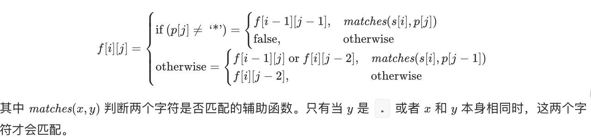

## 题目类型

1. 堆栈树
2. 优先队列
3. Map、Set、有限态枚举(秒、个、状态) 空间换时间
4. 优先队列
5. 分治
6. 动态规划
7. 贪婪算法
8. 位运算(有限状态)
9. 拓扑排序

## LeetCode

- https://leetcode.cn/problems/trapping-rain-water/

  

- https://leetcode.cn/problems/longest-valid-parentheses/ 最长合法括号


- https://leetcode.cn/problems/regular-expression-matching/ 正则
  
  
  
- https://leetcode.cn/problems/rotate-image/
  
  
  
- https://leetcode.cn/problems/sliding-window-maximum/  滑动窗口最大值
  - nums[i]>nums[i-1] 则前推并删除栈内比nums[i]小的idx，i入栈，并清理滑动出去的下标
  - 最大值为max(nums[stack[0]],nums[i])
  
- https://leetcode.cn/problems/construct-binary-tree-from-preorder-and-inorder-traversal/
  - 优先确定当前节点的左子树(即前序节点的下一个节点在中序的左侧)，并入栈
  - 依次出栈且跳过与之对应的中序(对应代表无右节点)
  - 若有右节点，则挂载，并重新开始第一步
  
- https://leetcode.cn/problems/shortest-unsorted-continuous-subarray/ 最短无序子数组
  - 从左到右维持max遍历，当出现数据小于max时，说明此数据是要排序的
  - 从右到左维持min遍历，当出现数据大于min时，说明此数据是要排序的
  
- https://leetcode.cn/problems/maximal-square/  面积最大正方形
  
  
  
- https://leetcode.cn/problems/find-the-duplicate-number/  [1,n]的长为n+1数组，找出重复元素
  - 方法一：修改原数组，映射归位判定
  - 方法二：Floyd 判圈算法  有环图之快慢指针
  
- https://leetcode.cn/problems/search-a-2d-matrix-ii/ 行列有序矩阵查找
  - 从右上角开始Z字查找，每次排除一行或一列
  
- https://leetcode.cn/problems/partition-equal-subset-sum/ 分组使和相等 背包问题
  - 分组后两边和相等，则sum不能为奇数，sum/2需大于任意元素
  
  - dp i=len(nums) j=sum/2+1 即仅使用前i个数字并使和为j

    
  
    
  
- https://leetcode.cn/problems/burst-balloons/ 扎气球
  - dp[i][j] 为戳破i~j范围的气球所谓获得的硬币的最大值，边界数值有效
  - 为处理边界情况，最好补足多余边界
  
- https://leetcode.cn/problems/queue-reconstruction-by-height/ 身高排序
  - 按身高从高到低排序，按人数从低到高次排序(题目中是>=自身身高的个数)
  
- https://leetcode.cn/problems/remove-invalid-parentheses/ 删除无效括号 使最长
  - dfs 穷举&set剪枝

## 海盗分金

5个海盗抢得100枚金币,他们按抽签的顺序依次提方案:首先由1号提出分配方案,然后5人表决,投票要超过半数同意方案才被通过,否则他将被扔入大海喂鲨鱼,依此类推

```java
public static int[] subCoin(int coins,int members){
        if(coins<=0 || members<=0)return new int[0];
        if(members==1)return new int[]{coins};
        if(members==2)return new int[]{coins,0};
        if(members==3)return new int[]{0,0,coins};
        int[] resp=new int[members];
        //key 海盗编号 value 持有金币      待拉拢人员
        Map<Integer,Integer> keepCoins=new TreeMap<>();
        keepCoins.put(0,0);
        keepCoins.put(1,0);
        //金币数,持有人数                  拉拢人员分组
        Map<Integer,Integer> coinGroups=new TreeMap<>();
        coinGroups.put(0,2);
        //当前人数下(3),可拿到的钱数
        int maxMax=coins;
        //下一个人拉拢足够人数需要的金币
        int costCoins=0;
        //迭代时 i-2 不录入(防止出现分给i-2的情况)
        int i;
        for(i=4;i<=members;i++){
            //需要争取的支持数量
            int supports=i/2;
            Iterator<Map.Entry<Integer,Integer>> iter=coinGroups.entrySet().iterator();
            //拉拢某个人需要的金币的Max
            int max=0;
            //分max金币人数
            int maxCount=supports;
            costCoins=0;
            //统计分配金币最少的supports个人、costCoins
            while(iter.hasNext()){
                Map.Entry<Integer,Integer> entry=iter.next();
                max=entry.getKey();
                if(entry.getValue()>=maxCount){
                    costCoins+=(max+1)*maxCount;
                    break;
                }else{
                    costCoins+=(max+1)*entry.getValue();
                    maxCount-=entry.getValue();
                }
            }
            if(costCoins>=coins)break;
            coinGroups.clear();
            coinGroups.put(0,i-supports-1);
            coinGroups.put(max+1,maxCount);
            //分金币 将小于max的人的金币+1,等于max的前maxCount人的金币+1,其余置为0
            Iterator<Map.Entry<Integer,Integer>> iter2=keepCoins.entrySet().iterator();
            while(iter2.hasNext()){
                Map.Entry<Integer,Integer> entry=iter2.next();
                if(entry.getValue()>max){
                    entry.setValue(0);
                }else{
                    if(entry.getValue()==max){
                        if(maxCount>0){
                            maxCount--;
                            entry.setValue(max+1);
                        }else{
                            entry.setValue(0);
                        }
                    }else{
                        entry.setValue(entry.getValue()+1);
                        coinGroups.put(entry.getValue(), coinGroups.getOrDefault(entry.getValue(),0) + 1);
                    }
                }
            }
            maxMax=coins-costCoins;
            keepCoins.put(i-2,0);
        }
        for(int ii=0;ii<members;ii++){
            resp[ii]=keepCoins.getOrDefault(ii,0);
        }
        resp[i-2]=maxMax;
        return resp;
    }
```

## 蚂蚁爬杆

告诉你有一个长为L（L<=10000）的木杆,上面有N(N<=1000)个蚂蚁,他们一开始的朝向随机,他们会以一定的速度一直向当前方向走,直到两只蚂蚁相遇,他们会立即掉头(即往相反方向走),注意,掉头不耗时间,问:
1、所有蚂蚁掉下去所需要的时间
2、所有蚂蚁走过的行程
3、所有蚂蚁的碰撞次数
4、蚂蚁的掉落顺序

1~3均为一类问题,考虑蚂蚁碰撞后,不是掉头而是继续前行(交换身份),1~3可在O(N)时间内解决
4需要明确的是掉落的蚂蚁肯定是最两端的其中一只,只需要确定每次是哪一端掉落,而要确定哪一端掉落只需明确对应时间点是朝哪个方向的蚂蚁掉落了即可;首先利用1中思路可以确定各个蚂蚁的掉落时间(不一一对应),而且也可以知道其方向(可通过正负区分,时间为距离端点的绝对值)

## 楼层摔鸡蛋

N层楼, 2个鸡蛋, 确定哪一层楼恰好不摔坏, 求最坏情况下尝试次数

数学分析法(逆向思维)

假定最优解是X次,那么第一次应该从第X层扔(假定从X+1层扔,摔坏了,则需要X+1次与最优解不符;假定从X-1次扔,摔坏了,则需要X-1次,与最优解亦不符),若X层摔坏了,则需要从头尝试X-1次;若没摔坏,则从剩余N-X层继续尝试X-1次,则此次累加的楼层应该是X-1,依次类推,即X+(X-1)+(X-2)+...+1=(X+1)X/2=N,X向上取整 

动态规划法(把楼层考虑为区间大小)

```java
//2个鸡蛋情况
public static int eggDrop(int height){
    int[] dp=new int[height+1];
    for(int i=1;i<=height;i++){
        dp[i]=i;//从1L尝试场景
        for(int j=2;j<=i;j++){//从j楼开始尝试场景
            dp[i]=Math.min(dp[i],1+Math.max(j-1,dp[i-j]));//max指最坏情况
        }
    }
    return dp[height];
}
/**
m个鸡蛋情况
设f{n,m}表示n层楼、m个鸡蛋时找到最高楼层的最少尝试次数。当第一个鸡蛋从第i层扔下，如果碎了，还剩m-1个鸡蛋，为确定下面楼层中的安全楼层，还需要f{i-1,m-1}次；不碎的话，上面还有n-i层，还需要f[n-i,m]次，又一个子问题。 状态转移方程如下： f{n, m} = min(1 + max(f{i - 1, m - 1}, f{n - i, m})，f{n,m}) ) 其中： i为(1, n), f{i, 1} = 1
*/
public static int superEggDrop(int height,int eggs){
    int[][] dp=new int[height+1][eggs+1];
    for(int i=1;i<=height;i++)dp[i][1]=i;
    for(int i=1;i<=eggs;i++)dp[1][i]=1;
    for(int h=2;h<=height;h++){
        for(int egg=2;egg<=eggs;egg++){
            dp[h][egg]=1+Math.max(dp[0][egg-1],dp[h-1][egg]);
            for(int dh=2;dh<=h;dh++){
                dp[h][egg]=Math.min(dp[h][egg],1+Math.max(dp[dh-1][egg-1],dp[h-hd][egg]));
            }
        }
    }
    return dp[height][eggs];
}
/*NK解法. 利用当N变大时,dis也会变大,避免回溯*/
public int superEggDrop(int K, int N) {//N 楼层
    int[][] dp=new int[N+1][K];
    for(int j=1;j<=N;j++)dp[j][0]=j;
    for(int i=0;i<K;i++)dp[1][i]=1;
    for(int n=1;n<K;n++){
        int dis=1;
        for(int i=1;i<=N;i++){
            while(dis<i && 
                Math.max(dp[dis-1][n-1],dp[i-dis][n])>Math.max(dp[dis][n-1],dp[i-dis-1][n])){
                dis++;
            }
            dp[i][n]=Math.max(dp[dis-1][n-1],dp[i-dis][n])+1;
        }
    }
    return dp[N][K-1];
}
```

## 红包算法

```java
private static BigDecimal min=new BigDecimal("0.01");
public static BigDecimal divideRedPacket(BigDecimal left, int people){
    BigDecimal money=BigDecimal.ZERO;
    if(people==1){
        money=new BigDecimal(left.toString());
        left=BigDecimal.ZERO;
    }else if(people>1){
        Random rd=new Random();
        BigDecimal max=left.divide(new BigDecimal(people/2.0),2, RoundingMode.FLOOR);
        money=max.multiply(new BigDecimal(rd.nextDouble())).setScale(2,RoundingMode.FLOOR);
        money=money.compareTo(min)<=0?min:money;
        left=left.subtract(money);
    }
    people--;
    return money;
}
```


## 背包问题

### 0/1背包问题

有N件物品和一个容量为V的背包, 第i件物品体积是w[i], 价值是val[i]求解将哪些物品装入背包可使这些物品的费用总和不超过背包容量, 且价值总和最大
F(i,v)=Math.max( F(i-1,v), F(i-1,v-w[i] )+val[i])

```java
//0/1背包问题 权重向量,体积向量,背包空间
public static int maxWeight(int[] weights,int[] vs,int maxV){
    if(weights==null || vs==null||weights.length!=vs.length || vs.length==0)return 0;
    int[] dp=new int[maxV+1]; //体积
    for(int i=maxV;i>=vs[0];i--){
        dp[i]=weights[0];
    }
    for (int i = 1; i < vs.length; i++) {
        for(int j=maxV;j>=vs[i];j--) {
             dp[j] = Math.max(dp[j], dp[j - vs[i]] + weights[i]);
        }
    }
    return dp[maxV];
}
```

### 完全背包问题

算法同0/1背包问题,只是需要遍历选择第i个产品共k次

### 重复背包问题

算法同完全背包问题,多重限制i个产品的数量

## KMP

```java
public int KMP(String match,String pattern){
	if(match==null || pattern==null ||match.length()<pattern.length())return -1;
	if(match.equals(pattern))return 0;
	char[] mcs=match.toCharArray();
	char[] pcs=pattern.toCharArray();
	int[] next=next(pcs);
	int k=0;
	for(int i=0;i<mcs.length;){
		if(k==-1 || mcs[i]=pcs[k]){
			if(k==pcs.length-1)return i+1-pcs.length;
			k++;
			i++;
		}else{
			k=next[k];
		}
	}
}
int[] next(char[] cs){
	int[] next=new int[cs.length];
	next[0]=-1;
	int k=-1;
	int i=0;
	while(i<cs.length-1){
		if(k==-1 || cs[i]==cs[k]){
			i++;
			k++;
			next[i]=k;
		}else{
			k=next[k];
		}
	}
	return next;
}
```


## 映射

```java
/*给定一个未排序的整数数组(含重复、负数，0)，找出其中没有出现的最小的正整数。*/
public int firstMissingPositive(int[] nums) {
    int i=0;
    while(i<nums.length){
        if(nums[i]<=0 || nums[i]>nums.length || nums[nums[i]-1]==nums[i]){
            i++;
        }else{
            int tmp=nums[nums[i]-1];
            nums[nums[i]-1]=nums[i];
            nums[i]=tmp;
        }
    }
    for(int j=0;j<nums.length;j++){
        if(nums[j]!=j+1)return j+1;
    }
    return nums.length+1;
}
```


## 二分查找

```java
/*给定两个非空有序增序列,得到第K小的数*/
public int getKth(int[] nums1,int[] nums2,int k){
    int low1=0,low2=0;//要留下的数字的下标
    int m=nums1.length;
    int n=nums2.length;
    int left=k;
    while(left>1 && low1!=m && low2!=n){
        int lf=left>>1;
        int nextLow1=Math.min(m,low1+lf);
        int nextLow2=Math.min(n,low2+lf);
        if(nums1[nextLow1-1]<=nums2[nextLow2-1]){
            left-=nextLow1-low1;
            low1=nextLow1;
        }else{
            left-=nextLow2-low2;
            low2=nextLow2;
        }
    }
    if(low1==m) return nums2[k-m-1];
    if(low2==n) return nums1[k-n-1];
    return Math.min(nums1[low1],nums2[low2]);
}
/*给定两个非空有序增序列,取得中位数,利用getKth()*/
public double findMedianSortedArrays(int[] nums1, int[] nums2) {
    int m=nums1.length;
    int n=nums2.length;
    if(m==0)return (nums2[n>>1]+nums2[(n-1)>>1])/2.0;
    if(n==0)return findMedianSortedArrays(nums2,nums1);
    int sum=m+n;
    if((sum&1)==1) return getKth(nums1,nums2,(sum+1)>>1);
    return (getKth(nums1,nums2,sum>>1)+getKth(nums1,nums2,(sum>>1)+1))/2.0;
}
public double findMedianSortedArrays2(int[] nums1, int[] nums2) {
    int m=nums1.length;
    int n=nums2.length;
    //划分m为m1、m2  划分n为n1、n2  使得 m1+n1+2=m+n-m2-n2或m1+n1+1=m+n-m2-n2,
    //并使得nums1[m1]<=nums2[n2] && nums2[n1]<=nums1[m2]
    if(m>n)return findMedianSortedArrays(nums2,nums1);
    int mMax=m,mMin=0;
    while(mMax>=mMin){
        int i=(mMax+mMin)>>1;//个数
        int j=(m+n+1)/2-i;//个数
        if(i!=0 && j!=n && nums1[i-1]>nums2[j]){
            mMax=i-1;
        }else if(j!=0 && i!=m && nums2[j-1]>nums1[i]){
            mMin=i+1;
        }else{
            int max=0;
            if(i==0)max=nums2[j-1];
            else if(j==0)max=nums1[i-1];
            else max=Math.max(nums1[i-1],nums2[j-1]);
            if(((m+n)&1)==1)return max;
            int min=0;
            if(i==m)min=nums2[j];
            else if(j==n)min=nums1[i];
            else min=Math.min(nums1[i],nums2[j]);
            return (max+min)/2.0;
        }
    }
    return 0.0;
}
```


## 双指针

```java
/*给定 n 个非负整数表示每个宽度为 1 的柱子的高度图，计算按此排列的柱子，下雨之后能接多少雨水 
对于节点i,只要它的左右存在大于它的,那在这个节点上就能接到雨水,且雨水的大小为Math.min(lH,rH)-height[i]*/
public int trap(int[] h){
    if(h==null || h.length<2)return 0;
    int left=0,right=h.length-1;
    int total=0;
    int ml=h[left];
    int mr=h[right];
    while(left<right){//在最高点相遇
        ml=Math.max(ml,h[left]);
        mr=Math.max(mr,h[right]);
        if(ml<mr){
            total+=Math.min(ml,mr)-h[left];
            left++;
        }else{
            total+=Math.min(ml,mr)-h[right];
            right--;
        }
    }
    return total;
}
```

```java
/*给你一个字符串 S、一个字符串 T，请在字符串 S 里面找出：包含 T 所有字母的最小子串。
输入: S = "ADOBECODEBANC", T = "ABC"
输出: "BANC"
如果 S 中不存这样的子串，则返回空字符串 ""。
如果 S 中存在这样的子串，我们保证它是唯一的答案。
*/
     public String minWindow(String s, String t) {
        if(s==null || t==null || s.length()<t.length())return "";
        char[] cs=s.toCharArray();
        char[] ct=t.toCharArray();
        Map<Character,Integer> tm=new HashMap<>();
        Map<Character,Integer> tmKeep=new HashMap<>();
        for(int i=0;i<ct.length;i++){
            tm.put(ct[i],tm.getOrDefault(ct[i],0)+1);
            tmKeep.put(ct[i],tmKeep.getOrDefault(ct[i],0)+1);
        }
        Map<Character,Integer> counts=new HashMap<>();
        String sub=s;
        boolean ctn=false;
        int begin=0;
        for(int i=0;i<cs.length;i++){
            if(tm.containsKey(cs[i])){
                int count=tm.get(cs[i]);
                if(count==1){
                    tm.remove(cs[i]);
                }else{
                    tm.put(cs[i],count-1);
                }
                counts.put(cs[i],counts.getOrDefault(cs[i],0)+1);
            }else if(counts.containsKey(cs[i])){
                counts.put(cs[i],counts.get(cs[i])+1);
            }
            if(tm.size()==0){
                ctn=true;
                while(!tmKeep.containsKey(cs[begin]) || counts.get(cs[begin])>tmKeep.get(cs[begin])){
                    if(counts.containsKey(cs[begin])){
                        counts.put(cs[begin],counts.get(cs[begin])-1);
                    }
                    begin++; 
                }
                if(sub.length()>i-begin+1)sub=s.substring(begin,i+1);
                tm.put(cs[begin],1);
                counts.put(cs[begin],counts.get(cs[begin])-1);
                begin++;
            }
        }
        return ctn?sub:"";
    }
```

## 分治

```java
/**
对于某些固定的 N，如果数组 A 是整数 1, 2, ..., N 组成的排列，使得：对于每个 i < j，都不存在 k 满足 i < k < j 使得 A[k] * 2 = A[i] + A[j]。那么数组 A 是漂亮数组。给定 N，返回任意漂亮数组 A（保证存在一个）。
思路,A[k]*2是偶数,则将其两侧划分为奇数和偶数等式一定成立; 对于一侧通过仿射实现分治
*/
Map<Integer,int[]> dict;
public int[] beautifulArray(int N) {
    if(N<=0)return new int[0];
    dict=new HashMap<>();
    return f(N);
}
int[] f(int n){    
    if(n==1)return new int[]{1};
    if(dict.containsKey(n))return dict.get(n);
    int[] ans=new int[n];
    int i=0;
    for(int num:f((n+1)/2)){
        ans[i++]=num*2-1;
    }
    for(int num:f(n/2)){
        ans[i++]=num*2;
    }
    dict.put(n,ans);
    return ans;
}
```

## 栈

```java
/*给定 n 个非负整数，用来表示柱状图中各个柱子的高度。每个柱子彼此相邻，且宽度为 1 。
求在该柱状图中，能够勾勒出来的矩形的最大面积。*/
public int largestRectangleArea(int[] heights) {
    if(heights==null ||heights.length==0)return 0;
    int max=0;
    for(int i=0;i<heights.length;i++){
        int j=i-1,k=i+1;
        while(j>=0 && heights[j]>=heights[i])j--;
        while(k<heights.length && heights[k]>=heights[i])k++;
        max=Math.max(max,heights[i]*(k-j-1));
    }
    return max;
}
public int largestRectangleArea(int[] hs) {
    if(hs==null ||hs.length==0)return 0;
    Stack<Integer> stack=new Stack<>();
    stack.push(-1);
    int max=0;
    for(int i=0;i<hs.length;i++){
        while(stack.peek()!=-1 && hs[stack.peek()]>=hs[i]){
            max=Math.max(hs[stack.pop()]*(i-stack.peek()-1),max);
        }
        stack.push(i);
    }
    while(stack.peek()!=-1){
        max=Math.max(hs[stack.pop()]*(hs.length-1-stack.peek()),max);
    }
    return max;
}
/*给定一个仅包含 0 和 1 的二维二进制矩阵，找出只包含 1 的最大矩形，并返回其面积。*/
public int maximalRectangle(char[][] m) {
    if(m==null || m.length==0 ||m[0].length==0)return 0;
    int[] hs=new int[m[0].length];
    int max=0;
    for(int i=0;i<m.length;i++){
        for(int j=0;j<m[0].length;j++){
            hs[j]=m[i][j]=='0'?0:(hs[j]+1);
        }
        max=Math.max(max, maxRect(hs));
    }
    return max;
}
int maxRect(int[]  hs){
    Stack<Integer> stack=new Stack<>();
    stack.push(-1);
    int max=0;
    for(int i=0;i<hs.length;i++){
        while(stack.peek()!=-1 && hs[stack.peek()]>=hs[i]){
            max=Math.max(hs[stack.pop()]*(i-stack.peek()-1),max);
        }
        stack.push(i);
    }
    while(stack.peek()!=-1){
        max=Math.max(hs[stack.pop()]*(hs.length-1-stack.peek()),max);
    }
    return max;
}
```

## 队列

```java
/* 给定一个数组 nums，有一个大小为 k 的滑动窗口从数组的最左侧移动到数组的最右侧。你只可以看到在滑动窗口内的 k 个数字。滑动窗口每次只向右移动一位。返回滑动窗口最大值*/
public int[] maxSlidingWindow(int[] nums, int k) {
    if(nums==null ||nums.length==0)return new int[0];
    int[] res=new int[nums.length-k+1];
    LinkedList<Integer> l=new LinkedList<>();
    for(int i=0;i<nums.length;i++){
        if(l.size()>0 && i-l.peek() == k)l.pop();
        while(l.size()>0 && nums[l.peek()]<=nums[i]){
            l.pop();
        }
        while(l.size()>0 && nums[l.getLast()]<=nums[i]){
            l.removeLast();
        }
        l.add(i);
        if(i>=k-1)res[i-k+1]=nums[l.peek()];
    }
    return res;
}
```

## 优先队列

```java
/*这里有 n 门不同的在线课程，他们按从 1 到 n 编号。每一门课程有一定的持续上课时间（课程时间）t 以及关闭时间第 d 天。一门课要持续学习 t 天直到第 d 天时要完成，你将会从第 1 天开始。
给出 n 个在线课程用 (t, d) 对表示。你的任务是找出最多可以修几门课。*/
public int scheduleCourse(int[][] courses) {
    if(courses==null ||courses.length==0)return 0;
    Arrays.sort(courses,(a,b)->a[1]-b[1]);
    PriorityQueue<Integer> queue=new PriorityQueue<>((a,b)->b-a);
    int dead=0;
    for(int i=0;i<courses.length;i++){
        if(dead+courses[i][0]<=courses[i][1]){
            dead+=courses[i][0];
            queue.add(courses[i][0]);
        }else{
            if(queue.size()>0 && queue.peek()>courses[i][0]){
                dead+=courses[i][0]-queue.poll();
                queue.add(courses[i][0]);
            }
        }
    }
    return queue.size();
}
```

## Set

```java
/*给定一个未排序的整数数组，找出最长连续序列的长度。要求算法的时间复杂度为 O(n)。
输入: [100, 4, 200, 1, 3, 2]  输出: 4
解释: 最长连续序列是 [1, 2, 3, 4]。它的长度为 4*/
public int longestConsecutive(int[] nums) {
    if(nums.length<2)return nums.length;
    Set<Integer> set=new HashSet<>();
    for(int num:nums)set.add(num);
    int max=1;
    for(int num:nums){
        if(set.remove(num)){
            int m=1;
            int n=num;
            while(set.remove(--n))m++;
            n=num;
            while(set.remove(++n))m++;
            max=Math.max(max,m);
        }
    }
    return max;
}
```


## LinkedList

### 单链表反转

```java
public static  Node reverse(Node root){
    if(root==null || root.next==null)return root;
    Node head=new Node(-1);
    head.next=root;
    Node t=root.next;
    while(t!=null){
        root.next=t.next;
        t.next=head.next;
        head.next=t;
        t=root.next;
    }
    return head.next;
}
```

## Tree

### 中序遍历

```java
public List<Integer> inorderTraversal(TreeNode root) {//利用右节点遍历完肯定是null,跳过再次入栈
    Stack<TreeNode> stack=new Stack<>();
    List<Integer> res=new ArrayList<>();
    TreeNode node=root;
    while(node!=null || !stack.isEmpty()){
        while(node!=null){
            stack.push(node);
            node=node.left;
        }
        node=stack.pop();
        res.add(node.val);
        node=node.right;
    }
    return res;
}
```

### 前序遍历

```java
public List<Integer> preorderTraversal(TreeNode root) {//父节点及时出栈
    List<Integer> pre=new ArrayList<>();
    Stack<TreeNode> stack=new Stack<>();
    if(root!=null){
        stack.push(root);
        while(stack.size()>0){
            TreeNode node=stack.pop();
            pre.add(node.val);
            if(node.right!=null){
                stack.push(node.right);
            }
            if(node.left!=null){
                stack.push(node.left);
            }
        }
    }
    return pre;
}
```

### 后序遍历(前序遍历+addFirst)

```java
public List<Integer> postorderTraversal(TreeNode root) {
    LinkedList<TreeNode> queue=new LinkedList<>();
    LinkedList<Integer> array=new LinkedList<>();
    if(root==null)return array;
    queue.add(root);
    while(!queue.isEmpty()){
        TreeNode node=queue.removeLast();
        array.push(node.val);
        if(node.left!=null){
            queue.add(node.left);
        }
        if(node.right!=null){
            queue.add(node.right);
        }
    }
    return array;
}
```

### 层序遍历

```java
 public List<List<Integer>> levelOrder(TreeNode root) {
        List<List<Integer>> array=new ArrayList<>();
        if(root==null)return array;
        List<TreeNode> level=new LinkedList<>();
        level.add(root);
        while(level.size()>0){
            int i=level.size();
            List<Integer> nums=new ArrayList<>();
            while(i>0){
                TreeNode node=level.remove(0);
                nums.add(node.val);
                if(node.left!=null)level.add(node.left);
                if(node.right!=null)level.add(node.right);
                i--;
            }
            array.add(nums);
        }
        return array;
}
```

### 锯齿遍历

```java
public List<List<Integer>> zigzagLevelOrder(TreeNode root) {
        List<List<Integer>> array=new ArrayList<>();
        if(root==null)return array;
        LinkedList<TreeNode> level=new LinkedList<>();
        level.add(root);
        boolean left=true;
        while(level.size()>0){
            List<Integer> nums=new ArrayList<>();
            LinkedList<TreeNode> Nlevel=new LinkedList<>();
            for(TreeNode node:level){
                nums.add(node.val);
                if(left){
                  if(node.left!=null)Nlevel.push(node.left);
                  if(node.right!=null)Nlevel.push(node.right);
                }else{
                  if(node.right!=null)Nlevel.push(node.right);
                  if(node.left!=null)Nlevel.push(node.left);
                }
            }
            level=Nlevel;
            array.add(nums);
            left=!left;
        }
        return array;
}
```

### 哈弗曼树

```java
public static TreeNode haffman(int[] nums){
    if(nums==null || nums.length==0)return null;
    TreeMultimap<Integer,TreeNode> nodes=TreeMultimap.create(Ordering.natural(),(o1,o2)->o1.val-o2.val==0?o1.hashCode()-o2.hashCode():o1.val-o2.val);
    for(int num:nums)nodes.put(num,new TreeNode(num));
    while(nodes.size()>1){
        Iterator<Map.Entry<Integer, TreeNode>> iter = nodes.entries().iterator();
        Map.Entry<Integer, TreeNode> n0 = iter.next();iter.remove();
        Map.Entry<Integer, TreeNode> n1 = iter.next();iter.remove();
        TreeNode nn=new TreeNode(n0.getKey()+n1.getKey());
        nn.right=n0.getValue();
        nn.left=n1.getValue();
        nodes.put(nn.val,nn);
    }
    return nodes.entries().iterator().next().getValue();
}
```

## 图

```java
//有向图环判定
public static boolean cycleGraph(int[][] graph){//边集合 [0]起点,[1]终点
    if(graph.length==0)return false;
    Map<Integer,Set<Integer>> edges=new HashMap<>();//顶点,入度顶点
    Set<Integer> nodes=new HashSet<>();
    for(int[] g:graph){
        if(map.get(g[1])==null)map.put(g[1],new HashSet<>());
        map.get(g[1]).add(g[0]);
        nodes.add(g[0]);
        nodes.add(g[1]);
    }
    while(nodes.size()>edges.size()){
        for(Iterator<Integer> iter=nodes.iterator();iter.hasNext();){
            Integer node=iter.next();
            if(!edges.containsKey(node)){
                iter.remove();
                for(Iterator<Map.Entry<Integer,Set<Integer>> iterm=map.entrySet().iterator();iterm.hasNext();){
                    Map.Entry<Integer,Set<Integer>> entry=iterm.next();
                    if(entry.getValue().contains(node)){
                        entry.getValue().remove(node);
                        if(entry.getValue().size()==0)iterm.remove();
                    }
                }
            }
        }
    }
    return edges.size()>0;
}
```

## 位运算

```java
//对一个正整数n，算得到1需要的最少操作次数。操作规则为：如果n为偶数，将其除以2；如果n为奇数，可以加1或减1；
public static int minStep(int key){
    int c=0;
    while(key>1){
        if((key&1)==0){
            key>>=1;
        }else if((key&3)==3 && key>3){
            key+=1;
        }else{
            key-=1;
        }
        c++;
    }
    return c;
}
//有一组数,除一个数出现1次之外,其余均出现了3次,求这个数 O(n),O(1)
//思路一  32N 对位加和除3取余, 对应位置就是出现1次数的位
//思路二  数字电路, 使用两个bit位来 实现3
/** A代表1 B代表2  出现01再+1则转换为0
	A   B   X         A'  B'
	0   0   0         0   0
	0   0   1         1   0
	1   0   1         0   1
	1   0   0         1   0
	0   1   1         0   0
	0   1   0         0   1
*/
public int findNum(int[] nums){
    int one=0;
    int two=0;
    for(int i:nums){
        one=(one^i)&~two;
        two=(two^i)&~one;
    }
    return one;
}
```

## 动态规划

```java
/*给定两个单词 word1 和 word2，计算出将 word1 转换成 word2 所使用的最少操作数 。
你可以对一个单词进行如下三种操作：
插入一个字符
删除一个字符
替换一个字符
dp[i][j]=Math.min(dp[i-1][j-1],dp[i-1][j],dp[i][j-1])+1 if w1[i]!=w2[j]
dp[i][j]=Math.min(dp[i-1][j-1],dp[i-1][j]+1,dp[i][j-1]+1) if w1[i]==w2[j]
*/
public int minDistance(String word1, String word2) {
    int l1=word1.length();
    int l2=word2.length();
    if(l1==0 ||l2==0)return Math.max(l1,l2);
    int[][] dp=new int [l1+1][l2+1];
    for(int i=0;i<=l1;i++){
        dp[i][0]=i;
    }
    for(int i=0;i<=l2;i++){
        dp[0][i]=i;
    }
    for(int i=1;i<=l1;i++){
        for(int j=1;j<=l2;j++){
            dp[i][j]=Math.min(Math.min(dp[i-1][j],dp[i][j-1])+1,dp[i-1][j-1]+(word1.charAt(i-1)==word2.charAt(j-1)?0:1));
        }
    }
    return dp[l1][l2];
}
```

```java
/*给你一个字符串 s 和一个字符规律 p，请你来实现一个支持 '.' 和 '*' 的正则表达式匹配。
'.' 匹配任意单个字符
'*' 匹配零个或多个前面的那一个元素
所谓匹配，是要涵盖 整个 字符串 s的，而不是部分字符串。
说明:
s 可能为空，且只包含从 a-z 的小写字母。
p 可能为空，且只包含从 a-z 的小写字母，以及字符 . 和 *。
*/
public boolean isMatch(String s, String p) {
    if(s.length()==0 && p.length()==0)return true;
    boolean[][] dp=new boolean[s.length()+1][p.length()+1];
    dp[0][0]=true;
    for(int i=2;i<=p.length();i++){
        dp[0][i]= dp[0][i-2] && (p.charAt(i-1)=='*');
    }
    for(int i=1;i<=s.length();i++){
        for(int j=1;j<=p.length();j++){
            if(s.charAt(i-1)==p.charAt(j-1) || p.charAt(j-1)=='.'){
                dp[i][j]=dp[i-1][j-1];
            }else if(p.charAt(j-1)=='*'){
                boolean ok=dp[i][j-2];
                if(!ok){
                    int k=i;
                    char c=p.charAt(j-2);
                    while(k>0 && (s.charAt(k-1)==c ||c=='.')){
                        ok=ok || dp[k-1][j-2];
                        if(ok)break;
                        k--;
                    }
                }
                dp[i][j]=ok;
            }
        }
    }
    return dp[s.length()][p.length()];
}
/* *代表任意字符*/
public boolean isMatch(String s, String p) {
    if(s.length()==0 && p.length()==0 || "*".equals(p))return true;
    boolean[][] dp=new boolean[s.length()+1][p.length()+1];
    dp[0][0]=true;
    for(int i=1;i<=p.length();i++){
        dp[0][i]= dp[0][i-1] && (p.charAt(i-1)=='*');
    }
    for(int i=1;i<=s.length();i++){
        for(int j=1;j<=p.length();j++){
            if(s.charAt(i-1)==p.charAt(j-1) || p.charAt(j-1)=='.'){
                dp[i][j]=dp[i-1][j-1];
            }else if(p.charAt(j-1)=='*'){
                boolean ok=false;
                int k=i;
                while(k>=0){
                    ok=ok || dp[k][j-1];
                    if(ok)break;
                    k--;
                }
                dp[i][j]=ok;
            }
        }
    }
    return dp[s.length()][p.length()];
}
```

```java
/*给定一个包含非负整数的 m x n 网格，请找出一条从左上角到右下角的路径，使得路径上的数字总和为最小。
说明：每次只能向下或者向右移动一步。
*/
public int minPathSum(int[][] grid) {
    if(grid==null || grid.length==0 ||grid[0].length==0)return 0;
    int[][] dp=new int[grid.length][grid[0].length];
    dp[0][0]=grid[0][0];
    for(int i=1;i<grid.length;i++){
        dp[i][0]=dp[i-1][0]+grid[i][0];
    }
    for(int i=1;i<grid[0].length;i++){
        dp[0][i]=dp[0][i-1]+grid[0][i];
    }
    for(int i=1;i<grid.length;i++){
        for(int j=1;j<grid[0].length;j++){
            dp[i][j]=Math.min(dp[i-1][j],dp[i][j-1])+grid[i][j];
        }
    }
    return dp[grid.length-1][grid[0].length-1];
}
```

```java
/*给定一个只包含 '(' 和 ')' 的字符串，找出最长的包含有效括号的子串的长度
*/
public int longestValidParentheses(String s) {//辅助栈
    if(s==null ||s.length()<2)return 0;
    Stack<Character> stack=new Stack<>();
    Stack<Integer> adder=new Stack<>();
    char[] cs=s.toCharArray();
    int max=0;
    int cur=0;
    for(char c:cs){
        if(c==')'){
            if(stack.size()==0){
                max=Math.max(cur,max);
                cur=0;
            }else{
                stack.pop();
                cur+=2;
                cur+=adder.pop();
            }
        }else{
            stack.push('(');
            adder.push(cur);
            cur=0;
        }
    }
    while(adder.size()>0){
        max=Math.max(max,adder.pop());
    }
    max=Math.max(cur,max);
    return max;
}
public int longestValidParentheses(String s) {
    if(s==null ||s.length()<2)return 0;
    int[] dp=new int[s.length()];//dp[i]代表以i开头的最长串
    int max=0;
    for(int i=s.length()-2;i>=0;i--){
        if(s.charAt(i)==')'){
            dp[i]=0;
        }else{
            int idx=dp[i+1]+i+1;
            if(idx<s.length() && s.charAt(idx)==')'){
                dp[i]=dp[i+1]+2;
                if(idx+1<s.length()){
                    dp[i]+=dp[idx+1];
                }
            }
        }
        max=Math.max(max,dp[i]);
    }
    return max;
}

```

```java
/* 给定一个字符串 s，找到 s 中最长的回文子串。你可以假设 s 的最大长度为 1000
*/
public String longestPalindrome(String s) {
    if(s==null ||s.length()==0)return "";
    boolean[][] dp=new boolean[s.length()][s.length()];
    for(int i=0;i<s.length();i++)dp[i][i]=true;
    int ki=0,kj=0;
    char[] cs=s.toCharArray();
    for(int i=s.length()-2;i>=0;i--){
        for(int j=i+1;j<s.length();j++){
            if(cs[i]==cs[j]){
                if(i+1==j)dp[i][j]=true;
                else dp[i][j]=dp[i+1][j-1];
            }
            if(dp[i][j] && j-i>kj-ki){
                kj=j;
                ki=i;
            }
        }
    }
    return s.substring(ki,kj+1);
}
/*最长回文子序列*/
public int longestPalindromeSubseq(String s) {
    if(s.length()<2)return s.length();
    int[][] dp=new int[s.length()][s.length()];
    for(int i=0;i<s.length();i++)dp[i][i]=1;
    for(int i=s.length()-1;i>=0;i--){
        for(int j=i+1;j<s.length();j++){
            if(s.charAt(i)==s.charAt(j)){
                dp[i][j]=dp[i+1][j-1]+2;
            }else{
                dp[i][j]=Math.max(dp[i+1][j],dp[i][j-1]);
            }
        }
    }
    return dp[0][s.length()-1];
}
```

```java
/*一条包含字母 A-Z 的消息通过以下方式进行了编码：
'A' -> 1   'Z' -> 26
给定一个只包含数字的非空字符串，请计算解码方法的总数
*/
public int numDecodings(String s) {
    if(s==null || s.length()==0)return 0;
    char[] cs=s.toCharArray();
    if(cs[0]=='0')return 0;
    int[] dp=new int[cs.length];
    dp[0]=1;
    for(int i=1;i<cs.length;i++){
        if(cs[i]=='0'){
            if(cs[i-1]=='0' || cs[i-1]>='3')return 0;
            if(i==1)dp[i]=1;
            else dp[i]=dp[i-2];
        }else{
            if(cs[i-1]=='0' || cs[i-1]>'2' || (cs[i-1]=='2' && cs[i]>'6')){
                dp[i]=dp[i-1];
            }else{
                dp[i]=dp[i-1]+(i>=2?dp[i-2]:1);
            }
        }
    }
    return dp[s.length()-1];
}
```

```java
/*不同的二叉搜索树*/
public int numTrees(int n) {
    int[] counts=new int[n+1];
    counts[0]=1;
    counts[1]=1;
    for(int i=2;i<=n;i++){
        int count=0;
        for(int j=0;j<i;j++){
            count+=counts[j]*counts[i-j-1];
        }
        counts[i]=count;
    }
    return counts[n];
}
```

```java
/*给定三个字符串 s1, s2, s3, 验证 s3 是否是由 s1 和 s2 交错组成的。*/
public boolean isInterleave(String s1, String s2, String s3) {
    if(s1==null ||s2==null ||s3==null)return false;
    if(s1.length()+s2.length()!=s3.length())return false;
    boolean[][] dp=new boolean[s1.length()+1][s2.length()+1];
    dp[0][0]=true;
    char[] cs1=s1.toCharArray();
    char[] cs2=s2.toCharArray();
    char[] cs3=s3.toCharArray();
    for(int i=1;i<=s1.length();i++){
        dp[i][0]=dp[i-1][0] && cs1[i-1]==cs3[i-1];
    }
    for(int i=1;i<=s2.length();i++){
        dp[0][i]=dp[0][i-1] && cs2[i-1]==cs3[i-1];
    }
    for(int i=1;i<=cs1.length;i++){
        for(int j=1;j<=cs2.length;j++){
            dp[i][j]=(dp[i][j-1] && cs2[j-1]==cs3[i+j-1]) || (dp[i-1][j] && cs1[i-1]==cs3[i+j-1]);
        }
    }
    return dp[cs1.length][cs2.length];
}
```

```java
/*股票问题 通用状态转移  天|次数|是否持有
dp[i][k][0] = max(dp[i-1][k][0], dp[i-1][k][1] + prices[i])
dp[i][k][1] = max(dp[i-1][k][1], dp[i-1][k-1][0] - prices[i])
给定一个数组，它的第 i 个元素是一支给定股票第 i 天的价格。
设计一个算法来计算你所能获取的最大利润。你可以尽可能地完成更多的交易（多次买卖一支股票）
*/
public int maxProfit(int[] prices){
    if(prices==null ||prices.length<2)return 0;
    int profit=0;
    for(int i=1;i<prices.length;i++){
        profit+=prices[i]>prices[i-1]?prices[i]-prices[i-1]:0;
    }
    return profit;
}
/*最多交易两次*/
public int maxProfit(int[] prices) {
    if(prices==null || prices.length<2)return 0；
        int buy1=-prices[0];//购买1
    int buy2=Integer.MIN_VALUE;//售卖1
    int sell1=Integer.MIN_VALUE;//购买2
    int sell2=Integer.MIN_VALUE;//售卖2
    for(int i=1;i<prices.length;i++){
        buy1=Math.max(buy1,-prices[i]);
        sell1=Math.max(sell1,buy1+prices[i]);
        buy2=Math.max(buy2,sell1-prices[i]);
        sell2=Math.max(sell2,buy2+prices[i]);
    }
    return sell2;
}
/*最多交易K次*/
public int maxProfit(int k, int[] prices) {
    if(prices==null || prices.length<2)return 0;
    if(k*2>=prices.length){
        return maxProfit(prices);
    }
    int dp[][]=new int[k+1][2];//天数,交易数内,是否持有 0持有
    for(int i=1;i<=k;i++) dp[i][0]=-prices[0];//初始化
    for(int i=1;i<prices.length;i++){
        for(int j=1;j<=k;j++){
            dp[j][0]=Math.max(dp[j][0],dp[j-1][1]-prices[i]);
            dp[j][1]=Math.max(dp[j][1],dp[j][0]+prices[i]);
        }
    }
    return dp[k][1];
}
```

```java
/*给定一个三角形，找出自顶向下的最小路径和。每一步只能移动到下一行中相邻的结点上。*/
public int minimumTotal(List<List<Integer>> triangle) {
    if(triangle==null || triangle.size()==0)return 0;
    int[] array=new int[triangle.size()];
    array[0]=triangle.get(0).get(0);
    int minL=Integer.MAX_VALUE;
    for(int k=1;k<triangle.size();k++){
        List<Integer> l=triangle.get(k);
        int tmp=array[0];
        array[0]+=l.get(0);
        for(int i=1;i<k;i++){
            int t=array[i];
            array[i]=Math.min(tmp,array[i])+l.get(i);
            tmp=t;
        }
        array[k]=tmp+l.get(k);
    }
    for(int i:array)minL=Math.min(minL,i);
    return minL;
}
```

```java
/*
给定一个字符串 S 和一个字符串 T，计算在 S 的子序列中 T 出现的个数。
一个字符串的一个子序列是指，通过删除一些（也可以不删除）字符且不干扰剩余字符相对位置所组成的新字符串。（例如，"ACE" 是 "ABCDE" 的一个子序列，而 "AEC" 不是）
*/
public int numDistinct(String t, String s) {
    if(s==null || t==null || s.length()>t.length() || t.length()==0)return 0;
    if(s.equals(t))return 1;
    int[][] dp=new int[s.length()][t.length()];
    char[] ts=t.toCharArray();
    int k=0;
    for(int i=0;i<t.length();i++){
        if(s.charAt(0)==ts[i])k++;
        dp[0][i]=k;
    }
    for(int i=1;i<s.length();i++){
        char c=s.charAt(i);
        for(int j=i;j<t.length();j++){
            if(c==ts[j]){
                dp[i][j]=dp[i][j-1]+dp[i-1][j-1];//这里[j-1]可防止连续重复
            }else{
                dp[i][j]=dp[i][j-1];
            }
        }
    }
    return dp[s.length()-1][t.length()-1];
}
```

```java
/*扰乱字符串*/
public boolean isScramble(String s1, String s2) {
    if(s1==null ||s2==null ||s1.length()!=s2.length())return false;
    if(s1.equals(s2))return true;
    boolean[][][] dp=new boolean[s1.length()][s2.length()][s1.length()];
    char[] cs1=s1.toCharArray();
    char[] cs2=s2.toCharArray();
    for(int i=0;i<cs1.length;i++){
        for(int j=0;j<cs2.length;j++){
            dp[i][j][0]=(cs1[i]==cs2[j]);
        }
    }
    for(int dh=1;dh<cs1.length;dh++){//坐标差  长度为dh+1
        for(int i=0;i<cs1.length-dh;i++){
            for(int j=0;j<cs2.length-dh;j++){
                for(int k=0;k<dh && !dp[i][j][dh] ;k++){
                    dp[i][j][dh]= dp[i][j][k] && dp[i+k+1][j+k+1][dh-k-1] || dp[i][j+dh-k][k] && dp[i+k+1][j][dh-k-1];
                }
            }
        }
    }
    return dp[0][0][cs1.length-1];
}
```

```java
/*你是一个专业的小偷，计划偷窃沿街的房屋，每间房内都藏有一定的现金。这个地方所有的房屋都围成一圈，这意味着第一个房屋和最后一个房屋是紧挨着的。同时，相邻的房屋装有相互连通的防盗系统，如果两间相邻的房屋在同一晚上被小偷闯入，系统会自动报警。
给定一个代表每个房屋存放金额的非负整数数组，计算你在不触动警报装置的情况下，能够偷窃到的最高金额。
*/
 public int rob(int[] nums) {
     if(nums==null || nums.length==0)return 0;
     if(nums.length==1)return nums[0];
     return Math.max(rob(nums,1,nums.length-1),rob(nums,0,nums.length-2));
 }
private int rob(int[] nums,int b,int e) {
    int rob=nums[b];
    int can=0;
    for(int i=b+1;i<=e;i++){
        int t=rob;
        rob=Math.max(rob,can+nums[i]);
        can=Math.max(can,t);
    }
    return Math.max(can,rob);
}
```

```java
/*给定一个非空字符串 s 和一个包含非空单词列表的字典 wordDict，判定 s 是否可以被空格拆分为一个或多个在字典中出现的单词*/
public boolean wordBreak(String s, List<String> wordDict) {
    if(s==null ||s.length()==0)return true;
    if(wordDict==null ||wordDict.size()==0)return false;
    boolean[] dp=new boolean[s.length()+1];
    dp[0]=true;
    for(int i=1;i<=s.length();i++){
        for(String word:wordDict){
            if(word.length()>i)continue;
            if(dp[i-word.length()] && word.equals(s.substring(i-word.length(),i))){
                dp[i]=true;
                break;
            }
        }
    }
    return dp[s.length()];
}
```

```java
/*一些恶魔抓住了公主（P）并将她关在了地下城的右下角。地下城是由 M x N 个房间组成的二维网格。我们英勇的骑士（K）最初被安置在左上角的房间里，他必须穿过地下城并通过对抗恶魔来拯救公主。
骑士的初始健康点数为一个正整数。如果他的健康点数在某一时刻降至 0 或以下，他会立即死亡。
有些房间由恶魔守卫，因此骑士在进入这些房间时会失去健康点数（若房间里的值为负整数，则表示骑士将损失健康点数）；其他房间要么是空的（房间里的值为 0），要么包含增加骑士健康点数的魔法球（若房间里的值为正整数，则表示骑士将增加健康点数）。
为了尽快到达公主，骑士决定每次只向右或向下移动一步。
编写一个函数来计算确保骑士能够拯救到公主所需的最低初始健康点数。
*/
public int calculateMinimumHP(int[][] dungeon) {
    if(dungeon==null ||dungeon.length==0 ||dungeon[0].length==0)return 0;
    int l1=dungeon.length;
    int l2=dungeon[0].length;
    int [][] dp=new int[l1][l2];
    dp[l1-1][l2-1]=dungeon[l1-1][l2-1]<0?1-dungeon[l1-1][l2-1]:1;
    for(int i=l1-2;i>=0;i--){
        dp[i][l2-1]=(dungeon[i][l2-1]-dp[i+1][l2-1])>=0?1:-(dungeon[i][l2-1]-dp[i+1][l2-1]);
    }
    for(int i=l2-2;i>=0;i--){
        dp[l1-1][i]=(dungeon[l1-1][i]-dp[l1-1][i+1])>=0?1:-(dungeon[l1-1][i]-dp[l1-1][i+1]);
    }
    for(int i=l1-2;i>=0;i--){
        for(int j=l2-2;j>=0;j--){
            int candi=dp[i+1][j]>dp[i][j+1]?dp[i][j+1]:dp[i+1][j];
            dp[i][j]=(dungeon[i][j]-candi)>=0?1:-(dungeon[i][j]-candi);
        }
    }
    return dp[0][0];
}
```

```java
/*给定一个非负整数数组，a1, a2, ..., an, 和一个目标数，S。现在你有两个符号 + 和 -。对于数组中的任意一个整数，你都可以从 + 或 -中选择一个符号添加在前面。
返回可以使最终数组和为目标数 S 的所有添加符号的方法数。*/
 public int findTargetSumWays(int[] nums, int S) {
     if(nums.length==0)return 0;
     return findTargetSumWays(nums,0,S);
 }
private int findTargetSumWays(int[] nums, int idx, int S) {
    if(idx==nums.length)return S==0?1:0;
    return findTargetSumWays(nums,idx+1,S+nums[idx])+findTargetSumWays(nums,idx+1,S-nums[idx]);
}
/*取sum=a1+a2+...+an,取目标函数S=？a1？a2？...？an 其中？代表正负号,则(S+sum)/2=ai+aj+...+ak
转为01背包问题,使用动态规划求解
*/
public int findTargetSumWays(int[] nums, int S){
    if(nums.length==0)return 0;
    int sum=0;
    for(int num:nums)sum+=num;
    S=(S+sum)/2;
    int[][] dp=new int[nums.length+1][S+1];
    for(int i=0;i<=nums.length;i++)dp[i][0]=1;
    for(int j=1;j<=nums.length;j++){
    	for(int i=1;i<=S;i++){
            if(i>=nums[j-1])dp[j][i]+=dp[j-1][i-nums[j-1]]++dp[j-1][i];
        }
    }
    return dp[nums.length][S];
}
```

```java
/*有 n 个气球，编号为0 到 n-1，每个气球上都标有一个数字，这些数字存在数组 nums 中。
现在要求你戳破所有的气球。每当你戳破一个气球 i 时，你可以获得 nums[left] * nums[i] * nums[right] 个硬币。 这里的 left 和 right 代表和 i 相邻的两个气球的序号。注意当你戳破了气球 i 后，气球 left 和气球 right 就变成了相邻的气球。
求所能获得硬币的最大数量。
说明:
你可以假设 nums[-1] = nums[n] = 1，但注意它们不是真实存在的所以并不能被戳破。
0 ≤ n ≤ 500, 0 ≤ nums[i] ≤ 100*/
public int maxCoins(int[] nums) {
    if(nums.length==0)return 0;
    //定义dp[i][j]为戳破(i+1,j-1)气球取得的最大值
    int[][] dp=new int[nums.length+2][nums.length+2];
    dp[0][1]=0;
    dp[nums.length][nums.length+1]=0;
    for(int i=1;i<nums.length;i++){
        dp[i][i+1]=0;
    }
    for(int i=nums.length;i>=0;i--){
        int iv=i==0?1:nums[i-1];
        for(int j=i+1;j<=nums.length+1;j++){
            int jv=j>nums.length?1:nums[j-1];
            for(int k=i+1;k<j;k++){
                dp[i][j]=Math.max(dp[i][j],dp[i][k]+dp[k][j]+iv*nums[k-1]*jv);
            }
        }
    }
    return dp[0][nums.length+1];
}
```

```java
/*俄罗斯信封套娃*/
public int maxEnvelopes(int[][] evp) {
    if(evp.length<2)return evp.length;
    Arrays.sort(evp,(a,b)->a[1]==b[1]?a[0]-b[0]:a[1]-b[1]);
    int[] dp=new int[evp.length];
    int max=1;
    dp[0]=1;
    for(int i=1;i<evp.length;i++){
        int[] ev=evp[i];
        dp[i]=1;
        for(int j=i-1;j>=0;j--){
            if(ev[0]>evp[j][0] && ev[1]>evp[j][1]){
                dp[i]=Math.max(dp[i],dp[j]+1);
            }
        }
        max=Math.max(max,dp[i]);
    }
    return max;
}
```

```java
/**
亚历克斯和李继续他们的石子游戏。许多堆石子 排成一行，每堆都有正整数颗石子 piles[i]。游戏以谁手中的石子最多来决出胜负。亚历克斯和李轮流进行，亚历克斯先开始。最初，M = 1。在每个玩家的回合中，该玩家可以拿走剩下的 前 X 堆的所有石子，其中 1 <= X <= 2M。然后，令 M = max(M, X)。游戏一直持续到所有石子都被拿走。假设亚历克斯和李都发挥出最佳水平，返回亚历克斯可以得到的最大数量的石头。
输入：piles = [2,7,9,4,4]  输出：10
解释：如果亚历克斯在开始时拿走一堆石子，李拿走两堆，接着亚历克斯也拿走两堆。在这种情况下，亚历克斯可以拿到 2 + 4 + 4 = 10 颗石子。 如果亚历克斯在开始时拿走两堆石子，那么李就可以拿走剩下全部三堆石子。在这种情况下，亚历克斯可以拿到 2 + 7 = 9 颗石子。所以我们返回更大的 10。 
*/
int[] sum;
int[][] dp;
public int stoneGameII(int[] piles) {
    int len=piles.length;
    sum=new int[len];
    sum[len-1]=piles[len-1];
    for(int i=len-2;i>=0;i--)sum[i]=sum[i+1]+piles[i];
    dp=new int[len][len];
    return find(piles,0,1);
}
public int find(int[] piles,int idx,int M){
    int len=piles.length;
    if(len-idx<=M*2){
        dp[idx][M]=sum[idx];
        return sum[idx];
    }
    if(dp[idx][M]!=0)return dp[idx][M];
    int min=Integer.MAX_VALUE;
    for(int X=1;X<=2*M;X++){
        min=Math.min(min,find(piles,idx+X,Math.max(M,X)));
    }
    dp[idx][M]=sum[idx]-min;
    return dp[idx][M];
}
```


## 贪婪算法

```java
/*给定一个用字符数组表示的 CPU 需要执行的任务列表。其中包含使用大写的 A - Z 字母表示的26 种不同种类的任务。任务可以以任意顺序执行，并且每个任务都可以在 1 个单位时间内执行完。CPU 在任何一个单位时间内都可以执行一个任务，或者在待命状态。
然而，两个相同种类的任务之间必须有长度为 n 的冷却时间，因此至少有连续 n 个单位时间内 CPU 在执行不同的任务，或者在待命状态。
你需要计算完成所有任务所需要的最短时间。
输入: tasks = ["A","A","A","B","B","B"], n = 2
输出: 8
执行顺序: A -> B -> (待命) -> A -> B -> (待命) -> A -> B.*/
public int leastInterval(char[] tasks, int n) {
    int[] map = new int[26];
    for (char c: tasks)map[c - 'A']++;
    Arrays.sort(map);
    int maxCycle = map[25] - 1;
    int idle= maxCycle * n;//徐要填充的数目
    for (int i = 24; i >= 0 && map[i] > 0; i--) {
        idle -= Math.min(map[i], maxCycle);
    }
    return idle > 0 ? idle + tasks.length : tasks.length;
}
```

```java
/*假设有打乱顺序的一群人站成一个队列。 每个人由一个整数对(h, k)表示，其中h是这个人的身高，k是排在这个人前面且身高大于或等于h的人数。 编写一个算法来重建这个队列。
注意：总人数少于1100人。
输入:[[7,0], [4,4], [7,1], [5,0], [6,1], [5,2]]
输出:[[5,0], [7,0], [5,2], [6,1], [4,4], [7,1]]*/
public int[][] reconstructQueue(int[][] people) {
    if(people==null || people.length==0)return people;
    PriorityQueue<int[]> queue=new PriorityQueue<>
        ((a1,a2)->{if(a1[0]==a2[0])return a1[1]-a2[1];return a2[0]-a1[0];});
    for(int[] p:people)queue.add(p);
    int[][] resp=new int[people.length][people[0].length];
    int count=0;
    while(queue.size()>0){
        int[] p=queue.poll();
        if(count>p[1])System.arraycopy(resp,p[1],resp,p[1]+1,count-p[1]);
        resp[p[1]]=p;
        count++;
    }
    return resp;
}
```


## 大数据

1. 25 T log,且log在不断增长,设计一个方案实现快速查询

   1. 建立适当索引, 考虑使用覆盖索引
   2. 优化查询语句
   3. 实现小数据量和海量数据的通用分页显示存储过程

2. N台机器,M个文件,每台机器宕机率<1/3, 设计合理方案实现文件不丢失

   GFS 思想,将M文件划分为 64MB 大小文件, 拓扑存储在N机器上, 每个数据存储3份, 如不考虑跨数据中心, 两份副本存储在同一机架, 另一份副本存储在其他机架, 同时保证效率和可用性

3. 设计一个系统,要求写速度尽可能地高

   思想就是将随机写转换为顺序写. 另外先写内存, 等内存达到一定大小,切换内存, 并将写满的内存顺序写到磁盘
